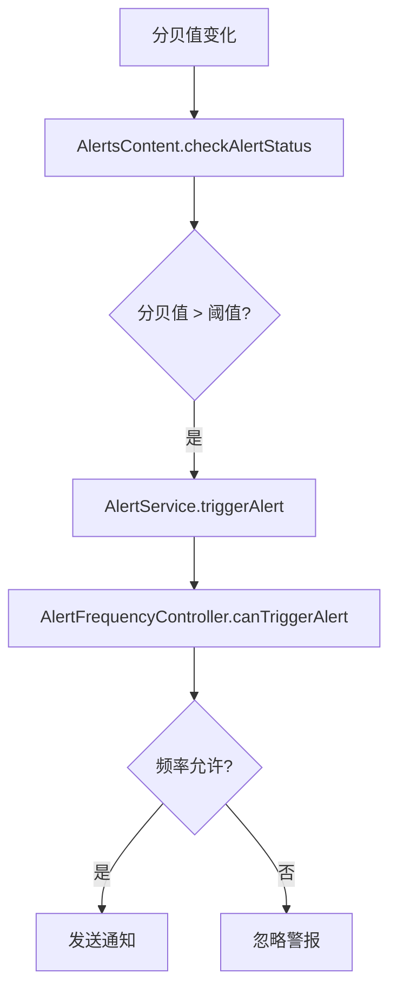
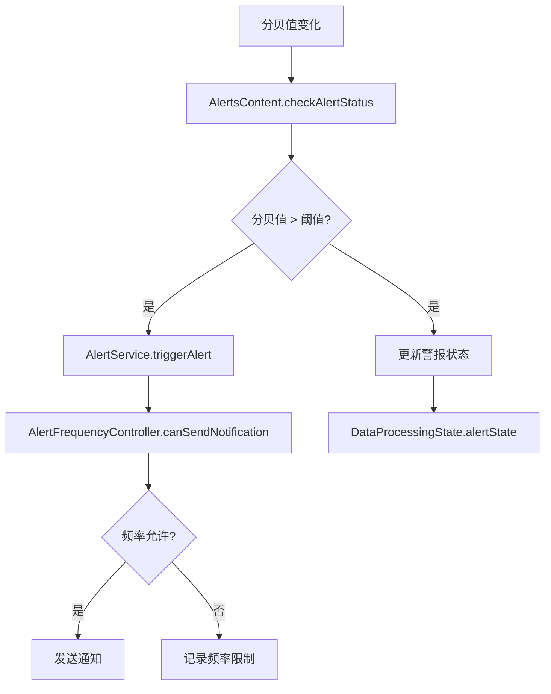

# 警报系统架构优化方案

## 当前架构问题分析

### 职责混淆
当前的 `AlertFrequencyController` 存在职责混淆问题：
- 既负责通知发送频率控制
- 又参与了警报触发决策逻辑

### 关键发现
1. **警报触发检测逻辑已经存在**：
   - 在 `AlertsContent.checkAlertStatus()` 中实现
   - 使用 `ThresholdManager.getCurrentEffectiveThreshold()` 获取阈值
   - 比较分贝值与阈值决定是否触发警报

2. **频率控制逻辑混淆**：
   - 在 `AlertService.triggerAlert()` 中，频率控制器直接决定是否触发警报
   - 这导致了：**警报触发被频率限制，这是错误的！**

## 正确的职责分离

### 警报触发 vs 通知发送
- **警报触发**：检测分贝值是否超过阈值，没有频率限制
- **通知发送**：发送系统通知，有频率限制

### 当前错误流程


### 正确流程


## 具体优化方案

### 1. 重构 AlertFrequencyController

**当前接口**：
```typescript
class AlertFrequencyController {
  canTriggerAlert(): boolean  // 错误：控制警报触发
  recordAlert(): void         // 错误：记录警报
  // ...
}
```

**重构后接口**：
```typescript
class AlertFrequencyController {
  canSendNotification(): boolean  // 正确：控制通知发送
  recordNotificationSent(): void  // 正确：记录通知发送
  // ...
}
```

### 2. 重构 AlertService.triggerAlert()

**当前逻辑**：
```typescript
public async triggerAlert(currentDecibel: number, threshold: number): Promise<void> {
  // 检查频率控制 - 错误：这阻止了警报触发
  if (!this.frequencyController.canTriggerAlert()) {
    hilog.info(DOMAIN, TAG, '警报在静默期内，忽略触发');
    return;  // 这里直接返回，导致警报无法触发！
  }
  
  // 更新警报状态
  appKeys.dataProcessingState.alertState.triggerAlert();
  
  // 发送通知
  await this.publishAlertNotification(currentDecibel, threshold);
  
  // 记录频率
  this.frequencyController.recordAlert();
}
```

**重构后逻辑**：
```typescript
public async triggerAlert(currentDecibel: number, threshold: number): Promise<void> {
  // 1. 总是更新警报状态（没有频率限制）
  const appKeys: AppKeys = AppStorageV2.connect(AppKeys)!;
  appKeys.dataProcessingState.alertState.triggerAlert();
  
  // 2. 检查是否可以发送通知（有频率限制）
  if (this.frequencyController.canSendNotification()) {
    // 发送通知
    await this.publishAlertNotification(currentDecibel, threshold);
    // 记录通知发送
    this.frequencyController.recordNotificationSent();
  } else {
    hilog.info(DOMAIN, TAG, '通知在静默期内，跳过发送');
  }
}
```

### 3. 保持 AlertsContent.checkAlertStatus() 不变

这个逻辑是正确的：
```typescript
private async checkAlertStatus(currentDecibel: number): Promise<void> {
  const threshold = ThresholdManager.getCurrentEffectiveThreshold();
  const shouldAlert = currentDecibel >= threshold && this.pk.system_notification_enabled;
  const isAlarmActive = this.ak.dataProcessingState.alertState.isActive;

  if (shouldAlert && !isAlarmActive) {
    // 触发警报 - 这里应该总是触发，不受频率限制
    await this.triggerAlarm(currentDecibel);
  } else if (!shouldAlert && isAlarmActive) {
    // 解除警报
    this.clearAlarm();
  }
}
```

## 实施步骤

### 第一步：重构 AlertFrequencyController
1. 重命名 `canTriggerAlert()` → `canSendNotification()`
2. 重命名 `recordAlert()` → `recordNotificationSent()`
3. 更新相关注释和日志

### 第二步：重构 AlertService.triggerAlert()
1. 将频率检查移到通知发送之前
2. 确保警报状态总是更新
3. 更新日志信息

### 第三步：验证功能
1. 确保警报触发没有频率限制
2. 确保通知发送有频率限制
3. 测试各种场景

## 预期效果

### 修复前的问题
- 警报触发被频率限制，导致用户无法及时知道噪音超标
- 职责混淆，难以维护

### 修复后的效果
- **警报触发**：实时响应，没有频率限制
- **通知发送**：智能频率控制，避免打扰用户
- **职责清晰**：每个组件有明确的单一职责

## 文件修改清单

### 需要修改的文件：
1. `entry/src/main/ets/services/AlertService.ets`
   - 重构 `AlertFrequencyController` 类
   - 重构 `AlertService.triggerAlert()` 方法

### 不需要修改的文件：
1. `entry/src/main/ets/components/alerts/AlertsContent.ets` - 逻辑正确
2. `entry/src/main/ets/services/ThresholdManager.ets` - 逻辑正确  
3. `entry/src/main/ets/models/DataProcessingState.ets` - 逻辑正确

## 总结

这个优化方案的核心是：
- **警报触发检测**：实时、无频率限制
- **通知发送**：智能频率控制
- **职责分离**：清晰的单一职责

这样既能保证用户及时知道噪音超标情况，又能避免通知过于频繁打扰用户。