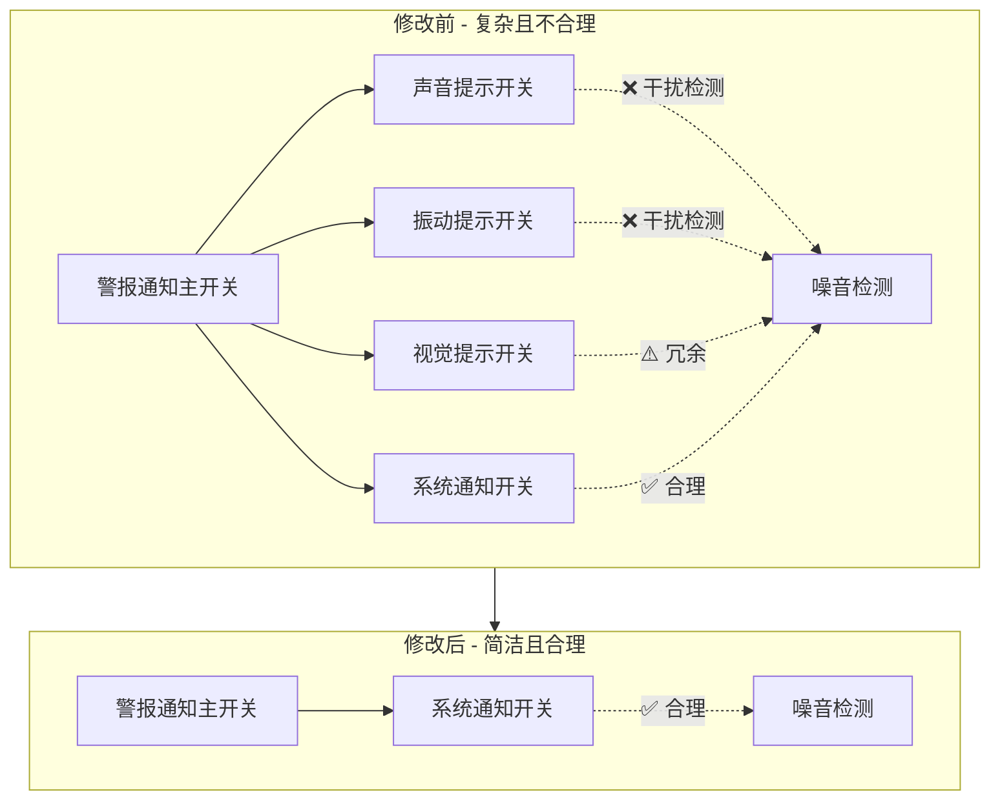
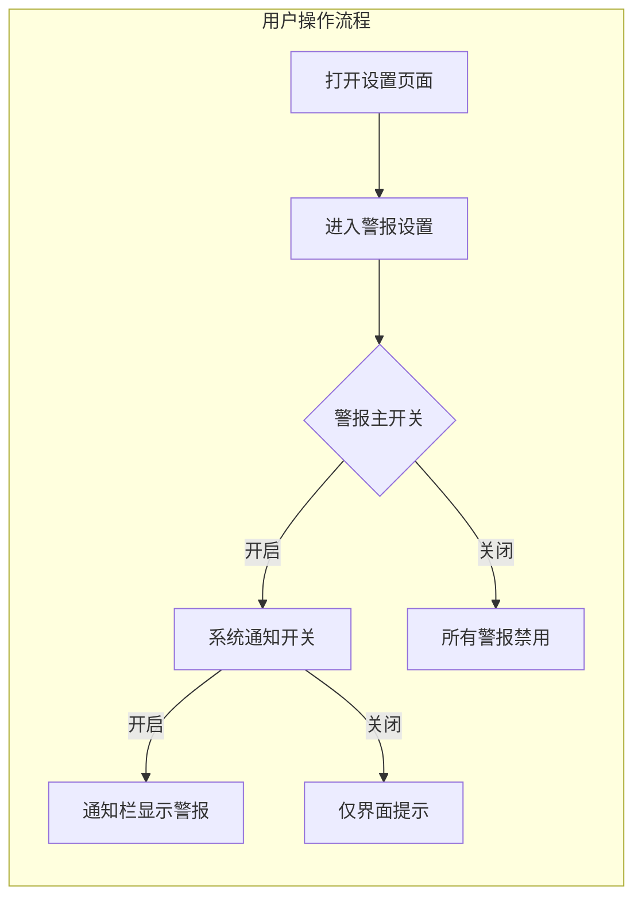
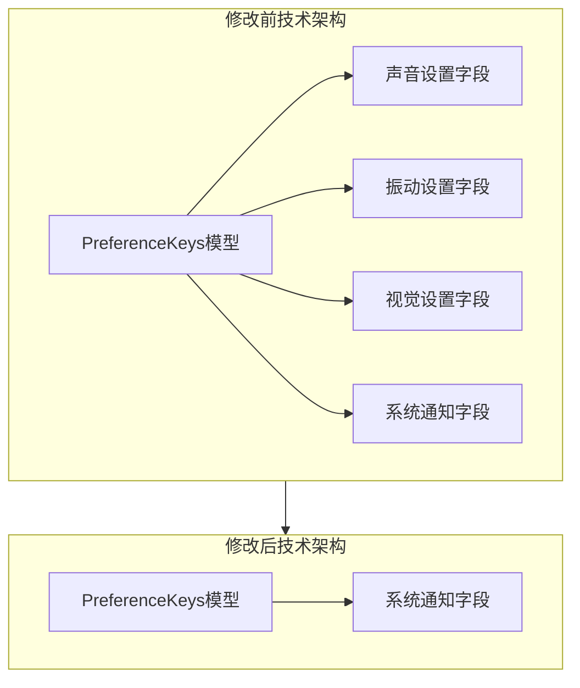

# 警报设置界面流程图

## 修改前后界面对比

## 用户操作流程

## 技术架构变化

## 核心改进点

### 1. 界面简化
- **从4个选项减少到1个选项**
- **消除用户决策负担**
- **界面更加清晰直观**

### 2. 功能优化
- **自动禁用干扰检测的功能**
- **保留核心有用的功能**
- **提升检测准确性**

### 3. 用户体验
- **设置过程更简单**
- **避免功能冲突**
- **专注核心需求**

## 预期效果

通过这次修改，用户将获得：
- 🎯 **更准确的噪音检测**
- 🎯 **更简洁的设置界面**
- 🎯 **更稳定的设备性能**
- 🎯 **更清晰的用户指引**