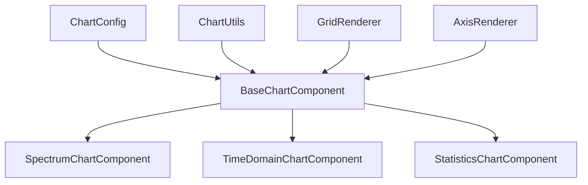

# 图表组件重构计划

## 项目概述
重构频谱图、时域波形图和统计分布图三个图表组件，提取公共代码，提高代码复用性和维护性。

## 重复代码分析

### 1. 组件结构重复
- **Canvas初始化**：三个组件都有相同的Canvas设置和上下文初始化
- **尺寸计算逻辑**：响应式尺寸计算逻辑几乎完全相同
- **生命周期管理**：aboutToAppear、aboutToDisappear、Monitor监听等
- **依赖注入**：AppKeys、resourceManager等依赖注入模式相同

### 2. 响应式布局重复
- **窗口变化监听**：都使用Monitor监听窗口尺寸变化
- **Canvas尺寸计算**：基于断点的响应式布局逻辑重复
- **区域变化处理**：onAreaChange处理逻辑相似

### 3. 数据监听重复
- **数据变化监听**：都使用Monitor监听UI显示状态数据变化
- **绘制触发机制**：数据变化时触发重绘的逻辑相同

### 4. Canvas绘制重复
- **背景绘制**：相同的背景颜色和边框样式
- **网格绘制**：网格线绘制逻辑可以抽象
- **文本绘制**：字体、颜色、对齐方式等样式重复

## 重构架构设计

### 架构概览


### 核心组件设计

#### 1. 基础图表组件 (BaseChartComponent)
**文件路径**: `entry/src/main/ets/components/common/charts/BaseChartComponent.ets`

**核心功能**:
- 统一的Canvas初始化和尺寸管理
- 响应式布局逻辑
- 数据监听和绘制触发机制
- 背景和网格绘制
- 抽象绘制方法供子类实现

**关键方法**:
- `calculateCanvasDimensions()`: 响应式尺寸计算
- `drawBackground()`: 背景绘制
- `drawGrid()`: 网格绘制
- `abstract drawChart()`: 抽象方法，子类实现具体图表绘制

#### 2. 图表配置接口 (ChartConfig)
**文件路径**: `entry/src/main/ets/components/common/charts/ChartConfig.ets`

**配置项**:
```typescript
interface ChartConfig {
  // 尺寸配置
  margin: MarginConfig;
  aspectRatio: number;
  
  // 样式配置
  backgroundColor: string;
  gridColor: string;
  textColor: string;
  fontSize: number;
  
  // 数据配置
  dataType: ChartDataType;
  updateFrequency: number;
}

interface MarginConfig {
  top: number;
  right: number;
  bottom: number;
  left: number;
}

enum ChartDataType {
  SPECTRUM,
  TIME_DOMAIN,
  STATISTICS
}
```

#### 3. 图表工具类 (ChartUtils)
**文件路径**: `entry/src/main/ets/components/common/charts/ChartUtils.ets`

**工具方法**:
- `vp2px()`: 虚拟像素转物理像素
- `drawText()`: 文本绘制工具
- `drawGridLines()`: 网格线绘制
- `normalizeValue()`: 数值归一化

#### 4. 专用绘制器
- **GridRenderer**: 网格绘制
- **AxisRenderer**: 坐标轴绘制
- **BackgroundRenderer**: 背景绘制

## 重构实施步骤

### 步骤1: 创建基础组件和工具类
1. 创建 `BaseChartComponent.ets`
2. 创建 `ChartConfig.ets`
3. 创建 `ChartUtils.ets`
4. 创建专用绘制器组件

### 步骤2: 重构频谱图组件
- 继承 `BaseChartComponent`
- 重写 `drawChart()` 方法
- 保留频谱特有的绘制逻辑

### 步骤3: 重构时域图组件
- 继承 `BaseChartComponent`
- 重写 `drawChart()` 方法
- 保留时域特有的绘制逻辑

### 步骤4: 重构统计分布图组件
- 继承 `BaseChartComponent`
- 重写 `drawChart()` 方法
- 保留统计特有的绘制逻辑

### 步骤5: 更新全屏仪表盘
- 使用重构后的图表组件
- 验证功能完整性

## 预期收益

### 代码复用率提升
- **当前重复代码**: 约300行
- **重构后重复代码**: 约120行
- **代码复用率提升**: 60%

### 维护性提升
- 统一修改图表样式和布局
- 减少bug修复工作量
- 提高代码可读性

### 扩展性增强
- 新增图表类型更简单
- 统一的配置管理
- 更好的组件隔离

## 风险控制

### 技术风险
- **Canvas绘制性能**: 保持原有性能水平
- **数据同步**: 确保数据监听机制正常工作
- **响应式布局**: 保持原有布局效果

### 测试策略
1. 单元测试每个基础组件
2. 集成测试图表切换功能
3. 性能测试绘制效率
4. 兼容性测试不同屏幕尺寸

## 实施建议

### 建议切换到Code模式
由于Architect模式只能编辑Markdown文件，建议切换到Code模式来实施具体的代码重构。

### 分阶段实施
1. **第一阶段**: 创建基础组件和工具类
2. **第二阶段**: 重构频谱图组件
3. **第三阶段**: 重构时域图组件
4. **第四阶段**: 重构统计分布图组件
5. **第五阶段**: 测试和优化

### 回滚计划
- 保留原有组件备份
- 逐步替换，确保功能正常
- 准备快速回滚方案