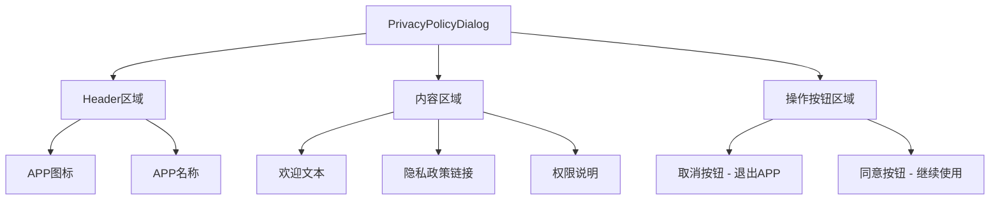

# 自定义隐私政策组件设计方案

## 项目背景
当前项目使用系统隐私政策配方（`privacyManager.requestAppPrivacyConsent()`），用户希望替换为自定义隐私政策组件，提供更好的用户体验和控制。

## 需求分析
- 显示APP图标和名称
- 提供隐私政策链接供用户查看
- 包含同意和取消按钮
- 用户取消或返回时退出APP
- 用户必须同意才能继续使用

## 组件设计

### 文件结构
```
entry/src/main/ets/components/privacy/
├── PrivacyPolicyDialog.ets          # 主对话框组件
└── PrivacyPolicyConstants.ets       # 常量定义
```

### UI结构设计


### 核心功能特性
1. **强制同意机制**：用户必须点击同意才能进入APP
2. **退出保护**：取消或返回直接退出APP
3. **链接支持**：可点击查看完整隐私政策
4. **美观设计**：符合项目设计规范

## 技术实现方案

### 组件参数设计
```typescript
interface PrivacyPolicyDialogParams {
  onAgree: () => void;        // 同意回调
  onCancel: () => void;       // 取消回调（退出APP）
}
```

### 主要文件内容

#### PrivacyPolicyDialog.ets
```typescript
@ComponentV2
export struct PrivacyPolicyDialog {
  @Param @Require onAgree: () => void;
  @Param @Require onCancel: () => void;
  
  // 构建Header区域
  @Builder
  private buildHeader() {
    Column({ space: DesignConstants.SPACING_MD }) {
      Image($r('app.media.app_icon_fore'))
        .width(80)
        .height(80)
      Text('静喵Sound')
        .fontSize(DesignConstants.FONT_SIZE_XL)
        .fontWeight(FontWeight.Bold)
    }
  }
  
  // 构建内容区域
  @Builder
  private buildContent() {
    Column({ space: DesignConstants.SPACING_MD }) {
      Text('欢迎使用静喵Sound噪音检测应用')
        .fontSize(DesignConstants.FONT_SIZE_LG)
        .fontWeight(FontWeight.Medium)
      
      Text('为了更好地为您提供服务，我们需要获取以下权限：')
        .fontSize(DesignConstants.FONT_SIZE_MD)
      
      // 权限说明列表
      this.buildPermissionList()
      
      // 隐私政策链接
      Text('查看完整隐私政策')
        .fontColor($r('sys.color.interactive_active'))
        .fontSize(DesignConstants.FONT_SIZE_MD)
        .decoration({ type: TextDecorationType.Underline })
        .onClick(() => {
          // 打开隐私政策链接
        })
    }
  }
  
  // 构建操作按钮
  @Builder
  private buildActionButtons() {
    Row({ space: DesignConstants.SPACING_MD }) {
      Button('取消', { type: ButtonType.Capsule })
        .layoutWeight(1)
        .onClick(() => this.onCancel())
      
      Button('同意并继续', { type: ButtonType.Capsule })
        .layoutWeight(1)
        .backgroundColor($r('sys.color.interactive_active'))
        .onClick(() => this.onAgree())
    }
  }
}
```

#### Index.ets集成方案
```typescript
// 替换原有的系统隐私政策检查
if (!this.pk.privacy_agreed) {
  // 显示自定义隐私政策对话框
  PrivacyPolicyDialogBuilder({
    onAgree: () => {
      this.pk.privacy_agreed = true;
    },
    onCancel: () => {
      // 退出APP逻辑
      this.context.terminateSelf();
    }
  })
}
```

## 字符串资源更新
需要在 `string.json` 中添加：
- 隐私政策欢迎文本
- 权限说明文本
- 按钮文本

## 实施步骤
1. 创建 `PrivacyPolicyDialog.ets` 组件文件
2. 创建 `PrivacyPolicyConstants.ets` 常量文件
3. 更新 `string.json` 资源文件
4. 修改 `Index.ets` 集成自定义组件
5. 测试完整功能流程

## 退出APP实现方案
使用 `UIAbilityContext.terminateSelf()` 方法实现退出APP功能：
```typescript
const context = getContext(this) as common.UIAbilityContext;
context.terminateSelf();
```

## 设计规范
- 使用 `DesignConstants` 保持设计一致性
- 遵循项目现有的颜色和间距规范
- 确保响应式布局适配不同屏幕尺寸

## 测试要点
- 首次启动显示隐私政策
- 同意后正常进入APP
- 取消或返回退出APP
- 隐私政策链接可点击
- 设计一致性检查