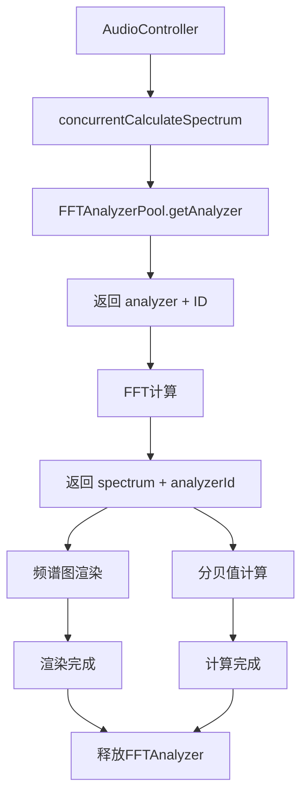

# FFT Analyzer Pool 设计方案

## 设计概述

创建一个FFTAnalyzerPool，预分配32个FFTAnalyzer实例，通过索引ID在整个计算流程中传递，在频谱图渲染和分贝值计算完成后释放。

## 核心设计

### 1. FFT Analyzer Pool 结构

```typescript
export class FFTAnalyzerPool {
  private static instance: FFTAnalyzerPool;
  private analyzers: Map<number, FFTAnalyzer> = new Map();
  private availableIds: number[] = [];
  private maxSize: number = 32;
  
  private constructor() {
    // 预分配32个FFTAnalyzer实例
    for (let i = 0; i < this.maxSize; i++) {
      this.availableIds.push(i);
    }
  }
  
  public static getInstance(): FFTAnalyzerPool {
    if (!FFTAnalyzerPool.instance) {
      FFTAnalyzerPool.instance = new FFTAnalyzerPool();
    }
    return FFTAnalyzerPool.instance;
  }
  
  // 获取FFTAnalyzer实例和ID
  public getAnalyzer(fftSize: number, windowType: WindowType, smoothingFactor: number, overlap: number): { analyzer: FFTAnalyzer; id: number } {
    if (this.availableIds.length === 0) {
      throw new Error('FFTAnalyzer池已满');
    }
    
    const id = this.availableIds.pop()!;
    let analyzer = this.analyzers.get(id);
    
    if (!analyzer) {
      // 创建新的FFTAnalyzer实例
      analyzer = new FFTAnalyzer(fftSize, windowType, smoothingFactor, overlap);
      this.analyzers.set(id, analyzer);
    } else {
      // 重用现有实例，更新配置
      analyzer.updateConfig(fftSize, windowType, smoothingFactor, overlap);
    }
    
    return { analyzer, id };
  }
  
  // 释放FFTAnalyzer实例
  public releaseAnalyzer(id: number): void {
    if (id >= 0 && id < this.maxSize) {
      this.availableIds.push(id);
    }
  }
  
  // 通过ID获取FFTAnalyzer实例
  public getAnalyzerById(id: number): FFTAnalyzer | undefined {
    return this.analyzers.get(id);
  }
}
```

### 2. 修改 concurrentCalculateSpectrum

```typescript
@Concurrent
export function concurrentCalculateSpectrum(
  buffer: ArrayBuffer,
  weightingType: WeightingType, 
  calibrationGain: number, 
  fftSize: number, 
  windowType: WindowType,
  smoothingFactor: number, 
  overlap: number
): { spectrum: Float32Array; analyzerId: number } {
  const analyzerPool = FFTAnalyzerPool.getInstance();
  
  // 从池中获取FFTAnalyzer实例和ID
  const { analyzer, id: analyzerId } = analyzerPool.getAnalyzer(fftSize, windowType, smoothingFactor, overlap);
  
  try {
    // 设置系统增益
    analyzer.setSystemGain(calibrationGain);
    
    // 执行FFT变换（使用FFTAnalyzer内部的内存池）
    const spectrum = analyzer.transform(buffer, weightingType);
    
    return {
      spectrum,
      analyzerId
    };
  } catch (error) {
    // 发生错误时释放analyzer
    analyzerPool.releaseAnalyzer(analyzerId);
    throw error;
  }
}
```

### 3. 修改 AudioController 使用方式

```typescript
taskpool.execute<[ArrayBuffer, WeightingType, number, number, WindowType, number, number], 
  { spectrum: Float32Array; analyzerId: number }>(
  concurrentCalculateSpectrum,
  buffer.slice(0),
  this.pk.weighting_type,
  this.pk.calibration_value,
  config.fftSize,
  config.windowType,
  config.smoothingFactor,
  config.overlap
).then((result) => {
  const { spectrum, analyzerId } = result;
  const analyzerPool = FFTAnalyzerPool.getInstance();
  
  try {
    // 1. 发送频谱数据给频谱图组件
    this.onSpectrumData(spectrum);
    
    // 2. 计算分贝值（通过ID获取同一个FFTAnalyzer实例）
    const analyzer = analyzerPool.getAnalyzerById(analyzerId);
    if (analyzer) {
      const db: number = analyzer.calculateAverageDb(spectrum);
      this.currentDecibel = Math.round(db);
    }
    
    // 3. 其他处理...
    this.updateStatistics(this.currentDecibel);
    this.checkAlarmStatus(this.currentDecibel);
    
  } finally {
    // 4. 在所有使用完成后释放FFTAnalyzer实例
    analyzerPool.releaseAnalyzer(analyzerId);
  }
});
```

### 4. 修改 FFTAnalyzer 内部实现

```typescript
export class FFTAnalyzer {
  // 内部使用现有的FFTMemoryPool
  private memoryPool = FFTMemoryPool.getInstance();
  
  // 内部transform方法使用内存池
  public transform(buffer: ArrayBuffer, weightingType: WeightingType): Float32Array {
    const real = this.memoryPool.getArray(this.size);
    const imag = this.memoryPool.getArray(this.size);
    const tempSpectrum = this.memoryPool.getArray(this.size / 2);
    
    try {
      // FFT计算逻辑...
      const spectrum = this.transformWithPool(real, imag, tempSpectrum, buffer, weightingType);
      return spectrum;
    } finally {
      // 注意：这里不释放数组，因为频谱数据还在使用
      // 数组会在FFTAnalyzer实例被释放时统一释放
    }
  }
  
  // 更新配置方法
  public updateConfig(fftSize: number, windowType: WindowType, smoothingFactor: number, overlap: number): void {
    if (this.size !== fftSize) {
      // 如果FFT大小改变，需要重新初始化
      this.initialize(fftSize, windowType, smoothingFactor, overlap);
    } else {
      // 只更新配置参数
      this.windowType = windowType;
      this.smoothingFactor = smoothingFactor;
      this.overlap = overlap;
    }
  }
}
```

## 数据流示意图



## 优势分析

### 性能优势
- **零动态分配**：FFTAnalyzer实例预分配，无运行时创建开销
- **内存复用**：FFTAnalyzer内部数组通过FFTMemoryPool复用
- **配置重用**：相同配置的FFT计算可以重用FFTAnalyzer实例

### 架构优势
- **简单清晰**：通过ID传递管理生命周期
- **线程安全**：每个线程使用独立的FFTAnalyzer实例
- **易于维护**：释放逻辑集中在AudioController中

### 内存占用
- **FFTAnalyzer实例**：32个 × 约200字节 ≈ 6.4KB
- **内部数组**：通过FFTMemoryPool管理，约6MB
- **总内存**：约6MB固定占用

## 实施步骤

1. **创建 FFTAnalyzerPool.ets**：实现FFTAnalyzer实例池
2. **修改 FFTAnalyzer.ets**：添加updateConfig方法，内部使用FFTMemoryPool
3. **修改 concurrentCalculateSpectrum**：返回包含analyzerId的结果
4. **修改 AudioController.ets**：使用analyzerId获取实例，完成后释放

这个方案完全符合你的设计思路，通过FFTAnalyzerPool管理32个实例，通过ID传递实现生命周期管理，在计算完成后正确释放。