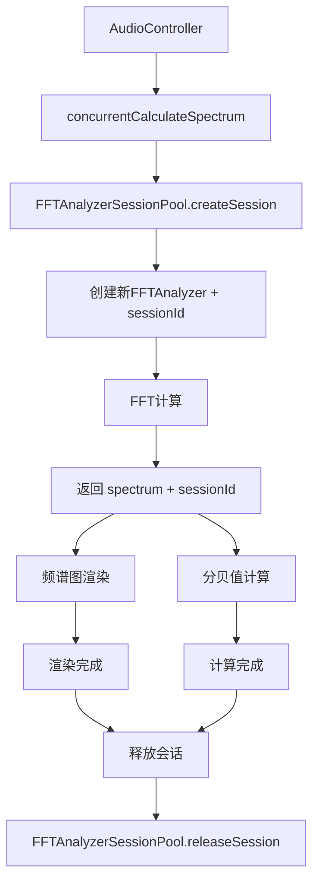

# FFT Analyzer Session Pool 设计方案

## 设计概述

由于计算配置非常多，无法预分配固定FFTAnalyzer实例。采用动态创建+会话ID传递的方案：
- 每次计算创建一个新的FFTAnalyzer实例
- 使用时间戳作为会话ID在整个流程中传递
- 在计算完成后释放对应的FFTAnalyzer实例

## 核心设计

### 1. FFT Analyzer Session Pool 结构

```typescript
export class FFTAnalyzerSessionPool {
  private static instance: FFTAnalyzerSessionPool;
  private sessions: Map<string, FFTAnalyzer> = new Map();
  
  private constructor() {}
  
  public static getInstance(): FFTAnalyzerSessionPool {
    if (!FFTAnalyzerSessionPool.instance) {
      FFTAnalyzerSessionPool.instance = new FFTAnalyzerSessionPool();
    }
    return FFTAnalyzerSessionPool.instance;
  }
  
  // 创建新的计算会话
  public createSession(fftSize: number, windowType: WindowType, smoothingFactor: number, overlap: number): { analyzer: FFTAnalyzer; sessionId: string } {
    const sessionId = Date.now().toString() + Math.random().toString(36).substr(2, 9);
    const analyzer = new FFTAnalyzer(fftSize, windowType, smoothingFactor, overlap);
    
    this.sessions.set(sessionId, analyzer);
    
    return { analyzer, sessionId };
  }
  
  // 通过会话ID获取FFTAnalyzer实例
  public getAnalyzerBySessionId(sessionId: string): FFTAnalyzer | undefined {
    return this.sessions.get(sessionId);
  }
  
  // 释放计算会话
  public releaseSession(sessionId: string): void {
    const analyzer = this.sessions.get(sessionId);
    if (analyzer) {
      // 清理FFTAnalyzer内部资源
      analyzer.cleanup();
      this.sessions.delete(sessionId);
    }
  }
  
  // 清理过期会话（防止内存泄漏）
  public cleanupExpiredSessions(maxAge: number = 60000): void {
    const now = Date.now();
    for (const [sessionId, analyzer] of this.sessions.entries()) {
      const sessionTime = parseInt(sessionId.substr(0, 13));
      if (now - sessionTime > maxAge) {
        analyzer.cleanup();
        this.sessions.delete(sessionId);
      }
    }
  }
}
```

### 2. 修改 concurrentCalculateSpectrum

```typescript
@Concurrent
export function concurrentCalculateSpectrum(
  buffer: ArrayBuffer,
  weightingType: WeightingType, 
  calibrationGain: number, 
  fftSize: number, 
  windowType: WindowType,
  smoothingFactor: number, 
  overlap: number
): { spectrum: Float32Array; sessionId: string } {
  const sessionPool = FFTAnalyzerSessionPool.getInstance();
  
  // 创建新的计算会话
  const { analyzer, sessionId } = sessionPool.createSession(fftSize, windowType, smoothingFactor, overlap);
  
  try {
    // 设置系统增益
    analyzer.setSystemGain(calibrationGain);
    
    // 执行FFT变换（使用FFTAnalyzer内部的内存池）
    const spectrum = analyzer.transform(buffer, weightingType);
    
    return {
      spectrum,
      sessionId
    };
  } catch (error) {
    // 发生错误时释放会话
    sessionPool.releaseSession(sessionId);
    throw error;
  }
}
```

### 3. 修改 AudioController 使用方式

```typescript
taskpool.execute<[ArrayBuffer, WeightingType, number, number, WindowType, number, number], 
  { spectrum: Float32Array; sessionId: string }>(
  concurrentCalculateSpectrum,
  buffer.slice(0),
  this.pk.weighting_type,
  this.pk.calibration_value,
  config.fftSize,
  config.windowType,
  config.smoothingFactor,
  config.overlap
).then((result) => {
  const { spectrum, sessionId } = result;
  const sessionPool = FFTAnalyzerSessionPool.getInstance();
  
  try {
    // 1. 发送频谱数据给频谱图组件
    this.onSpectrumData(spectrum);
    
    // 2. 计算分贝值（通过sessionId获取同一个FFTAnalyzer实例）
    const analyzer = sessionPool.getAnalyzerBySessionId(sessionId);
    if (analyzer) {
      const db: number = analyzer.calculateAverageDb(spectrum);
      this.currentDecibel = Math.round(db);
    }
    
    // 3. 其他处理...
    this.updateStatistics(this.currentDecibel);
    this.checkAlarmStatus(this.currentDecibel);
    
  } finally {
    // 4. 在所有使用完成后释放计算会话
    sessionPool.releaseSession(sessionId);
  }
});
```

### 4. 修改 FFTAnalyzer 内部实现

```typescript
export class FFTAnalyzer {
  // 内部使用现有的FFTMemoryPool
  private memoryPool = FFTMemoryPool.getInstance();
  
  // 内部transform方法使用内存池
  public transform(buffer: ArrayBuffer, weightingType: WeightingType): Float32Array {
    const real = this.memoryPool.getArray(this.size);
    const imag = this.memoryPool.getArray(this.size);
    const tempSpectrum = this.memoryPool.getArray(this.size / 2);
    
    try {
      // FFT计算逻辑...
      const spectrum = this.transformWithPool(real, imag, tempSpectrum, buffer, weightingType);
      return spectrum;
    } finally {
      // 注意：这里不释放数组，因为频谱数据还在使用
      // 数组会在cleanup方法中统一释放
    }
  }
  
  // 清理内部资源
  public cleanup(): void {
    // 释放所有从内存池获取的数组
    // 注意：这里需要记录哪些数组是从内存池获取的
    // 可以在transform方法中记录获取的数组，然后在cleanup中统一释放
  }
}
```

## 数据流示意图



## 优势分析

### 配置灵活性
- **动态适配**：每次计算都可以使用不同的FFT配置
- **无配置限制**：支持任意组合的FFT大小、窗函数、平滑因子等
- **即时创建**：按需创建FFTAnalyzer实例，无需预分配

### 内存管理
- **及时释放**：计算完成后立即释放FFTAnalyzer实例
- **防止泄漏**：自动清理过期会话
- **内存复用**：FFTAnalyzer内部仍然使用FFTMemoryPool复用数组

### 性能考虑
- **创建开销**：FFTAnalyzer实例创建开销很小（主要开销在内部数组分配）
- **内存占用**：会话数量有限（通常只有几个并发计算）
- **GC友好**：及时释放避免内存堆积

## 实施步骤

1. **创建 FFTAnalyzerSessionPool.ets**：实现动态会话管理
2. **修改 FFTAnalyzer.ets**：添加cleanup方法
3. **修改 concurrentCalculateSpectrum**：返回包含sessionId的结果
4. **修改 AudioController.ets**：使用sessionId获取实例，完成后释放会话

这个方案完全解决了配置多样性的问题，同时保持了内存池的性能优势。