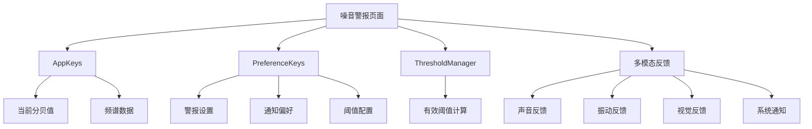

# 噪音警报功能完整架构总结

## 整体架构概述

### 核心设计理念
- **独立页面**: 噪音警报作为完全独立的页面存在
- **数据共享**: 通过AppKeys和PreferenceKeys获取共享状态信息
- **无耦合**: 与现有DecibelMeter组件无直接集成关系
- **渐进开发**: 先实现核心功能，后续逐步扩展

## 架构组件关系



## 核心组件设计

### 1. 独立警报页面结构

在[`NoiseMeterNavigation.ets`](entry/src/main/ets/pages/noisemeter/NoiseMeterNavigation.ets:1)中添加新的Tab：

```typescript
// 三Tab导航结构
Tabs({ barPosition: BarPosition.End, index: this.currentIndex }) {
  // 新增：噪音警报Tab
  TabContent() {
    AlertsContent()
  }
  .tabBar(this.TabBuilder('警报', $r('app.media.ic_alarm'), 0))

  // 原有：仪表盘Tab  
  TabContent() {
    DashboardContent()
  }
  .tabBar(this.TabBuilder('仪表盘', $r('app.media.ic_meter'), 1))

  // 原有：我的Tab
  TabContent() {
    MyContent()
  }
  .tabBar(this.TabBuilder('我的', $r('app.media.ic_favorite'), 2))
}
```

### 2. 数据获取机制

#### 通过AppKeys获取实时数据
```typescript
@Local as: AppKeys = AppStorageV2.connect(AppKeys)!;

// 获取当前分贝值
private get currentDecibel(): number {
  return this.as.db;
}

// 获取频谱数据（可选）
private get spectrumData(): Float32Array {
  return this.as.spectrumData;
}
```

#### 通过PreferenceKeys获取用户设置
```typescript
@Local pk: PreferenceKeys = PersistenceV2.connect(PreferenceKeys)!;

// 获取警报设置
private get isAlarmEnabled(): boolean {
  return this.pk.noise_alarm_enabled;
}

// 获取通知偏好
private get soundEnabled(): boolean {
  return this.pk.sound_alert_enabled;
}

private get vibrationEnabled(): boolean {
  return this.pk.vibration_alert_enabled;
}

private get visualEnabled(): boolean {
  return this.pk.visual_alert_enabled;
}

private get systemNotificationEnabled(): boolean {
  return this.pk.system_notification_enabled;
}
```

#### 通过ThresholdManager获取阈值
```typescript
// 获取当前有效阈值
private get currentThreshold(): number {
  return ThresholdManager.getCurrentEffectiveThreshold();
}
```

### 3. 警报检测逻辑

在警报页面内部实现独立的检测逻辑：

```typescript
// 监听分贝值变化
@Monitor('as.db')
onDecibelChange(monitor: IMonitor) {
  const currentDecibel = monitor.value<number>()?.now;
  if (currentDecibel !== undefined) {
    this.checkAlertStatus(currentDecibel);
  }
}

// 检测警报状态
private checkAlertStatus(currentDecibel: number): void {
  const threshold = this.currentThreshold;
  const isEnabled = this.isAlarmEnabled;
  
  if (isEnabled && currentDecibel >= threshold) {
    this.triggerAlarm(currentDecibel, threshold);
  } else {
    this.clearAlarm();
  }
}
```

### 4. 多模态反馈系统

#### 反馈控制器
```typescript
private executeAlarmFeedback(): void {
  if (this.soundEnabled) {
    this.playAlarmSound();
  }
  
  if (this.vibrationEnabled) {
    this.startVibration();
  }
  
  if (this.visualEnabled) {
    this.startVisualAlert();
  }
  
  if (this.systemNotificationEnabled) {
    this.showSystemNotification();
  }
}
```

#### 具体反馈实现
- **声音**: 使用系统提示音或简单音频
- **振动**: 调用系统振动API
- **视觉**: 页面内的闪烁效果和颜色变化
- **通知**: 使用现有NotificationHelper发送系统通知

## 页面功能模块

### 1. 实时状态显示区
- 当前分贝数值（从AppKeys获取）
- 当前阈值（从ThresholdManager获取）
- 警报状态指示（激活/安全）
- 环境质量评级

### 2. 快速控制面板
- 警报总开关（控制PreferenceKeys）
- 声音反馈开关
- 振动反馈开关
- 视觉反馈开关
- 系统通知开关

### 3. 环境信息区
- 环境质量描述
- 健康建议
- 当前时段信息

### 4. 设置入口
- 跳转到详细警报设置页面
- 使用现有的AlertsSettingsNavigation

## 技术实现优势

### 1. 架构简洁
- 完全独立的页面，无组件耦合
- 通过共享状态获取数据，避免重复逻辑
- 代码维护成本低

### 2. 数据一致性
- 使用AppKeys确保实时数据同步
- 使用PreferenceKeys确保设置一致性
- 所有组件使用相同的数据源

### 3. 用户体验
- 专门的警报页面便于管理
- 实时状态一目了然
- 快速控制操作便捷

### 4. 扩展性
- 后续可轻松添加历史记录
- 可扩展趋势分析功能
- 支持更多反馈类型

## 实施步骤

### 第一阶段：基础功能
1. 在NoiseMeterNavigation中添加警报Tab
2. 实现实时状态显示
3. 实现基础警报检测
4. 实现多模态反馈

### 第二阶段：功能完善
1. 添加环境信息显示
2. 优化视觉反馈效果
3. 完善用户设置同步

### 第三阶段：高级功能
1. 添加警报历史记录
2. 实现统计信息显示
3. 添加趋势分析

## 关键文件修改

### 需要修改的文件
- [`NoiseMeterNavigation.ets`](entry/src/main/ets/pages/noisemeter/NoiseMeterNavigation.ets:1) - 添加新的Tab

### 不需要修改的文件
- [`DecibelMeter.ets`](entry/src/main/ets/components/decibel-meter/DecibelMeter.ets:1) - 保持独立
- [`DecibelDisplayComponent.ets`](entry/src/main/ets/components/decibel-meter/DecibelDisplayComponent.ets:1) - 保持独立

### 使用的现有服务
- [`AppKeys`](entry/src/main/ets/models/AppKeys.ets:1) - 获取实时数据
- [`PreferenceKeys`](entry/src/main/ets/models/PreferenceKeys.ets:1) - 获取用户设置
- [`ThresholdManager`](entry/src/main/ets/services/ThresholdManager.ets:1) - 获取阈值
- [`NotificationHelper`](entry/src/main/ets/utils/NotificationHelper.ets:1) - 系统通知

这个架构确保了噪音警报功能的独立性和完整性，同时充分利用了现有的数据共享机制，实现了高效且可维护的设计。