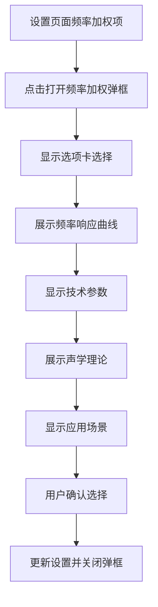

# 频率加权模式重新设计文档

## 设计目标
基于时间集权模式的设计理念，为频率加权(A/C/Z计权)创建完整的专业信息展示界面。

## 频率加权专业信息设计

### 1. 频率加权常量定义 (FrequencyWeightingConstants.ets)

```typescript
// 声学理论解释接口
export interface AcousticExplanation {
  frequencyResponse: string;      // 频率响应特性
  humanEarSimulation: string;     // 人耳模拟特性
  standardReference: string;      // 标准依据
  physicalPrinciple: string;      // 物理原理
  attenuationCharacteristics: string; // 衰减特性
}

// 技术参数接口
interface TechnicalParams {
  frequencyRange: string;         // 频率范围
  lowFreqAttenuation: string;     // 低频衰减
  highFreqAttenuation: string;    // 高频衰减
  referenceFreq: number;          // 参考频率
  flatResponseRange: string;      // 平坦响应范围
}

// 应用场景接口
export interface ApplicationScenario {
  title: string;                 // 场景标题
  description: string;           // 场景描述
  example: string;               // 实际示例
}

export class FrequencyWeightingConstants {
  // 声学理论解释
  static readonly ACOUSTIC_EXPLANATIONS: Record<WeightingType, AcousticExplanation> = {
    [WeightingType.A]: {
      frequencyResponse: '模拟40方等响曲线，对低频和高频进行衰减',
      humanEarSimulation: '模拟人耳在40分贝声压级下的听觉特性',
      standardReference: 'IEC 61672-1, GB/T 3785.1-2010 Class 1',
      physicalPrinciple: '基于等响曲线，在1kHz处为0dB，低频和高频衰减',
      attenuationCharacteristics: '低频衰减明显，高频轻微衰减，适合环境噪声评估'
    },
    [WeightingType.C]: {
      frequencyResponse: '模拟100方等响曲线，对低频衰减较少',
      humanEarSimulation: '模拟人耳在100分贝声压级下的听觉特性',
      standardReference: 'IEC 61672-1, GB/T 3785.1-2010 Class 1',
      physicalPrinciple: '基于等响曲线，在1kHz处为0dB，主要衰减低频',
      attenuationCharacteristics: '低频衰减较少，适合高声压级噪声测量'
    },
    [WeightingType.Z]: {
      frequencyResponse: '平坦频率响应，无频率加权',
      humanEarSimulation: '不模拟人耳特性，测量原始声压级',
      standardReference: 'IEC 61672-1, 零频率计权',
      physicalPrinciple: '线性响应，所有频率等权重处理',
      attenuationCharacteristics: '无衰减，适合声学研究和原始数据分析'
    }
  };

  // 技术参数配置
  static readonly TECHNICAL_PARAMS: Record<WeightingType, TechnicalParams> = {
    [WeightingType.A]: {
      frequencyRange: '20Hz-20kHz',
      lowFreqAttenuation: '31.5Hz处衰减39.4dB',
      highFreqAttenuation: '8kHz处衰减1.0dB',
      referenceFreq: 1000,
      flatResponseRange: '1kHz-4kHz'
    },
    [WeightingType.C]: {
      frequencyRange: '20Hz-20kHz',
      lowFreqAttenuation: '31.5Hz处衰减3.0dB',
      highFreqAttenuation: '8kHz处衰减0.3dB',
      referenceFreq: 1000,
      flatResponseRange: '63Hz-4kHz'
    },
    [WeightingType.Z]: {
      frequencyRange: '20Hz-20kHz',
      lowFreqAttenuation: '无衰减',
      highFreqAttenuation: '无衰减',
      referenceFreq: 1000,
      flatResponseRange: '全频段'
    }
  };

  // 应用场景配置
  static readonly APPLICATION_SCENARIOS: Record<WeightingType, ApplicationScenario[]> = {
    [WeightingType.A]: [
      {
        title: '环境噪声监测',
        description: '评估居住区、办公区的环境噪声水平',
        example: '城市道路、居民区、公园的环境噪声评估'
      },
      {
        title: '职业健康监测',
        description: '工作场所噪声暴露评估，保护听力健康',
        example: '工厂、车间、建筑工地的噪声监测'
      },
      {
        title: '社区噪声投诉',
        description: '处理居民对噪声的投诉和纠纷',
        example: '邻里噪声、商业噪声的合规性检查'
      }
    ],
    [WeightingType.C]: [
      {
        title: '工业噪声测量',
        description: '测量高声压级的工业设备噪声',
        example: '冲压机、发电机、空压机的噪声测量'
      },
      {
        title: '机械振动分析',
        description: '分析机械设备的低频噪声特性',
        example: '发动机、变速箱、轴承的噪声分析'
      },
      {
        title: '建筑声学',
        description: '评估建筑结构的隔声性能',
        example: '墙体、门窗、楼板的隔声量测量'
      }
    ],
    [WeightingType.Z]: [
      {
        title: '声学研究',
        description: '进行声学基础研究和数据分析',
        example: '声波传播特性、材料声学性能研究'
      },
      {
        title: '设备校准',
        description: '声级计和测量设备的校准',
        example: '传声器、声级计的频率响应校准'
      },
      {
        title: '原始数据分析',
        description: '获取未经加权的原始声压级数据',
        example: '声学信号处理、频谱分析的原始数据'
      }
    ]
  };

  // 频率响应曲线数据点 (用于绘制曲线)
  static readonly FREQUENCY_RESPONSE_DATA: Record<WeightingType, {freq: number, gain: number}[]> = {
    [WeightingType.A]: [
      {freq: 10, gain: -70.4}, {freq: 12.5, gain: -63.4}, {freq: 16, gain: -56.7},
      {freq: 20, gain: -50.5}, {freq: 25, gain: -44.7}, {freq: 31.5, gain: -39.4},
      {freq: 40, gain: -34.6}, {freq: 50, gain: -30.2}, {freq: 63, gain: -26.2},
      {freq: 80, gain: -22.5}, {freq: 100, gain: -19.1}, {freq: 125, gain: -16.1},
      {freq: 160, gain: -13.4}, {freq: 200, gain: -10.9}, {freq: 250, gain: -8.6},
      {freq: 315, gain: -6.6}, {freq: 400, gain: -4.8}, {freq: 500, gain: -3.2},
      {freq: 630, gain: -1.9}, {freq: 800, gain: -0.8}, {freq: 1000, gain: 0},
      {freq: 1250, gain: 0.6}, {freq: 1600, gain: 1.0}, {freq: 2000, gain: 1.2},
      {freq: 2500, gain: 1.3}, {freq: 3150, gain: 1.2}, {freq: 4000, gain: 1.0},
      {freq: 5000, gain: 0.5}, {freq: 6300, gain: -0.1}, {freq: 8000, gain: -1.1},
      {freq: 10000, gain: -2.5}, {freq: 12500, gain: -4.3}, {freq: 16000, gain: -6.6},
      {freq: 20000, gain: -9.3}
    ],
    [WeightingType.C]: [
      {freq: 10, gain: -14.3}, {freq: 12.5, gain: -11.2}, {freq: 16, gain: -8.5},
      {freq: 20, gain: -6.2}, {freq: 25, gain: -4.4}, {freq: 31.5, gain: -3.0},
      {freq: 40, gain: -2.0}, {freq: 50, gain: -1.3}, {freq: 63, gain: -0.8},
      {freq: 80, gain: -0.5}, {freq: 100, gain: -0.3}, {freq: 125, gain: -0.2},
      {freq: 160, gain: -0.1}, {freq: 200, gain: 0}, {freq: 250, gain: 0},
      {freq: 315, gain: 0}, {freq: 400, gain: 0}, {freq: 500, gain: 0},
      {freq: 630, gain: 0}, {freq: 800, gain: 0}, {freq: 1000, gain: 0},
      {freq: 1250, gain: 0}, {freq: 1600, gain: -0.1}, {freq: 2000, gain: -0.2},
      {freq: 2500, gain: -0.3}, {freq: 3150, gain: -0.5}, {freq: 4000, gain: -0.8},
      {freq: 5000, gain: -1.3}, {freq: 6300, gain: -2.0}, {freq: 8000, gain: -3.0},
      {freq: 10000, gain: -4.4}, {freq: 12500, gain: -6.2}, {freq: 16000, gain: -8.5},
      {freq: 20000, gain: -11.2}
    ],
    [WeightingType.Z]: [
      {freq: 10, gain: 0}, {freq: 12.5, gain: 0}, {freq: 16, gain: 0},
      {freq: 20, gain: 0}, {freq: 25, gain: 0}, {freq: 31.5, gain: 0},
      {freq: 40, gain: 0}, {freq: 50, gain: 0}, {freq: 63, gain: 0},
      {freq: 80, gain: 0}, {freq: 100, gain: 0}, {freq: 125, gain: 0},
      {freq: 160, gain: 0}, {freq: 200, gain: 0}, {freq: 250, gain: 0},
      {freq: 315, gain: 0}, {freq: 400, gain: 0}, {freq: 500, gain: 0},
      {freq: 630, gain: 0}, {freq: 800, gain: 0}, {freq: 1000, gain: 0},
      {freq: 1250, gain: 0}, {freq: 1600, gain: 0}, {freq: 2000, gain: 0},
      {freq: 2500, gain: 0}, {freq: 3150, gain: 0}, {freq: 4000, gain: 0},
      {freq: 5000, gain: 0}, {freq: 6300, gain: 0}, {freq: 8000, gain: 0},
      {freq: 10000, gain: 0}, {freq: 12500, gain: 0}, {freq: 16000, gain: 0},
      {freq: 20000, gain: 0}
    ]
  };

  // 获取计权类型显示名称
  static getWeightingDisplayName(type: WeightingType): string {
    switch (type) {
      case WeightingType.A:
        return 'A计权';
      case WeightingType.C:
        return 'C计权';
      case WeightingType.Z:
        return 'Z计权';
      default:
        return 'A计权';
    }
  }

  // 获取计权类型图标资源
  static getWeightingIcon(type: WeightingType): Resource {
    return $r('app.media.ic_frequency_weighting');
  }

  // 获取所有可用计权类型
  static getAvailableWeightings(): WeightingType[] {
    return [
      WeightingType.A,
      WeightingType.C,
      WeightingType.Z
    ];
  }
}
```

## 2. 组件设计结构

### 频率加权弹框 (FrequencyWeightingDialog.ets)
- 选项卡选择区域
- 频率响应曲线预览
- 技术参数显示
- 声学理论解释
- 应用场景说明
- 操作按钮区域

### 频率响应曲线组件 (FrequencyResponseChartComponent.ets)
- 绘制A/C/Z计权的频率响应曲线
- 支持对数频率坐标
- 显示增益/衰减值
- 交互式曲线展示

### 技术参数显示组件 (FrequencyTechnicalParamsDisplay.ets)
- 频率范围对比
- 衰减特性对比
- 应用频率范围
- 参数变化指示

## 3. 界面交互流程



## 4. 文件创建清单

需要创建的新文件：
- `entry/src/main/ets/constants/FrequencyWeightingConstants.ets`
- `entry/src/main/ets/components/frequency-weighting/FrequencyWeightingDialog.ets`
- `entry/src/main/ets/components/frequency-weighting/FrequencyResponseChartComponent.ets`
- `entry/src/main/ets/components/frequency-weighting/FrequencyTechnicalParamsDisplay.ets`
- `entry/src/main/ets/components/frequency-weighting/FrequencyAcousticExplanation.ets`

需要修改的现有文件：
- `entry/src/main/ets/pages/noisemeter/SettingsNavigation.ets`
- `entry/src/main/ets/constants/WeightingConstants.ets`

## 5. 实现优先级

1. **高优先级**: 频率加权常量文件和弹框基础结构
2. **中优先级**: 频率响应曲线组件和技术参数显示
3. **低优先级**: 声学理论解释和应用场景组件

这个设计将提供与时间集权模式相同级别的专业信息展示，帮助用户更好地理解不同频率加权模式的特性和适用场景。