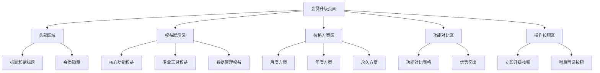

# 会员升级页面设计方案

## 设计概述

基于对现有UpgradeContent组件的分析，重新设计一个更加专业、吸引人的会员升级页面，突出专业版的核心价值，提供清晰的购买决策支持。

## 设计目标

- **价值突出**：清晰展示专业版的核心优势
- **对比明确**：免费版 vs 专业版功能对比
- **视觉吸引**：使用渐变色彩和图标增强体验
- **操作便捷**：简化购买流程，降低决策成本

## 页面架构



## 详细设计规范

### 1. 头部区域设计

**布局结构：**
- 应用图标 + 标题
- 副标题文案
- 会员徽章装饰

**视觉元素：**
- 渐变背景：`#1890FF` 到 `#03DAC6`
- 图标：使用 `ic_vip.svg` 图标
- 字体：标题使用 `FONT_SIZE_3XL`，副标题使用 `FONT_SIZE_MD`

### 2. 权益展示区设计

**核心权益列表：**
1. **多频率加权** - A/C/Z计权模式
2. **多时间加权** - 快速/慢速/脉冲响应
3. **智能时段警报** - 基于时间段的智能提醒
4. **专业数据导出** - CSV/PDF格式导出
5. **高级统计分析** - 趋势分析和报告生成
6. **无广告体验** - 纯净的使用环境

**视觉设计：**
- 使用网格布局，每行2-3个权益项
- 每个权益项包含图标、标题、描述
- 图标使用 `DesignConstants.ICON_SIZE_LG`
- 背景使用卡片阴影效果

### 3. 价格方案区设计

**方案配置：**

| 方案类型 | 价格 | 优惠 | 推荐标签 |
|---------|------|------|----------|
| 月度方案 | ¥15/月 | - | 灵活选择 |
| 年度方案 | ¥128/年 | 节省28% | 最受欢迎 |
| 永久方案 | ¥298 | 一次购买 | 永久拥有 |

**视觉设计：**
- 推荐方案使用特殊边框和背景色
- 价格突出显示，使用大号字体
- 优惠信息使用强调色显示
- 添加"最受欢迎"等标签

### 4. 功能对比区设计

**对比表格：**

| 功能特性 | 免费版 | 专业版 |
|---------|--------|--------|
| 频率加权 | 仅A计权 | A/C/Z计权 |
| 时间加权 | 仅快速 | 快速/慢速/脉冲 |
| 警报系统 | 基础警报 | 智能时段警报 |
| 数据导出 | 不支持 | CSV/PDF导出 |
| 统计分析 | 基础统计 | 高级分析 |
| 广告显示 | 有广告 | 无广告 |

### 5. 操作按钮区设计

**按钮配置：**
- **立即升级**：主按钮，使用 `$r('sys.color.ohos_id_color_palette1')`
- **稍后再说**：次按钮，使用 `$r('sys.color.background_secondary')`

**交互反馈：**
- 按钮点击动画效果
- 购买成功/失败提示
- 加载状态显示

## 技术实现要点

### 组件结构
```typescript
@ComponentV2
export struct UpgradeContent {
  @Param featureName: string;
  @Param featureDesc: string;
  @Param icon: Resource;
  
  // 新增参数
  @Param pricingPlans: PricingPlan[];
  @Param featureComparison: FeatureComparison[];
  @Param onUpgrade: () => void;
  @Param onLater: () => void;
}
```

### 数据模型
```typescript
interface PricingPlan {
  type: 'monthly' | 'yearly' | 'lifetime';
  price: number;
  originalPrice?: number;
  discount?: string;
  isRecommended: boolean;
}

interface FeatureComparison {
  feature: string;
  freeVersion: string;
  proVersion: string;
  isHighlight: boolean;
}
```

### 样式规范
- 使用 `DesignConstants` 中的间距和字体系统
- 颜色使用应用统一的颜色系统
- 阴影效果使用 `SHADOW_MD` 和 `SHADOW_LG`
- 圆角使用 `BORDER_RADIUS_LG`

## 交互设计

### 1. 页面进入动画
- 渐入效果，从底部向上滑动
- 各区域依次显示，有轻微延迟

### 2. 价格方案选择
- 点击方案时高亮显示
- 推荐方案默认选中
- 选择状态视觉反馈

### 3. 购买流程
- 点击"立即升级"显示加载状态
- 成功/失败状态提示
- 购买成功后自动关闭弹窗

### 4. 手势支持
- 支持下滑关闭弹窗
- 支持点击背景区域关闭

## 响应式设计

### 适配策略
- 使用相对单位适应不同屏幕尺寸
- 在小屏幕上调整布局为单列
- 在大屏幕上使用多列网格布局

### 断点设置
- 小屏幕 (< 360px)：单列布局
- 中屏幕 (360px - 768px)：两列布局
- 大屏幕 (> 768px)：三列布局

## 性能优化

### 1. 图片优化
- 使用矢量图标减少资源大小
- 懒加载非关键图片
- 压缩背景图片

### 2. 动画优化
- 使用硬件加速的动画
- 避免复杂的布局计算
- 使用适当的动画时长

### 3. 内存管理
- 及时释放不需要的资源
- 使用对象池复用组件
- 避免内存泄漏

## 测试要点

### 功能测试
- [ ] 价格方案显示正确
- [ ] 功能对比数据准确
- [ ] 购买流程正常
- [ ] 按钮交互响应

### 兼容性测试
- [ ] 不同屏幕尺寸适配
- [ ] 不同系统版本兼容
- [ ] 深色模式支持

### 性能测试
- [ ] 页面加载速度
- [ ] 动画流畅度
- [ ] 内存使用情况

## 后续优化方向

1. **个性化推荐**：基于用户使用习惯推荐方案
2. **试用功能**：提供7天免费试用
3. **家庭套餐**：支持多设备共享
4. **企业版**：针对企业用户的高级功能

---

**总结**：这个设计方案提供了一个完整、专业的会员升级页面，既满足了功能需求，又提供了良好的用户体验。设计遵循了应用现有的设计系统，确保了视觉一致性。