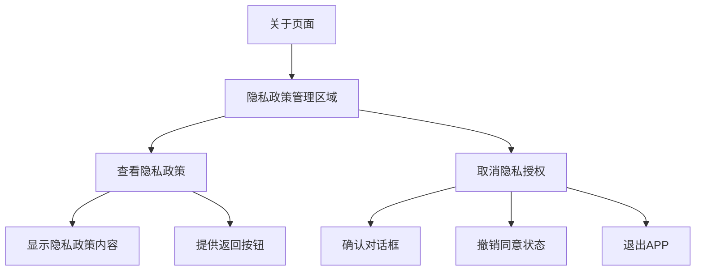
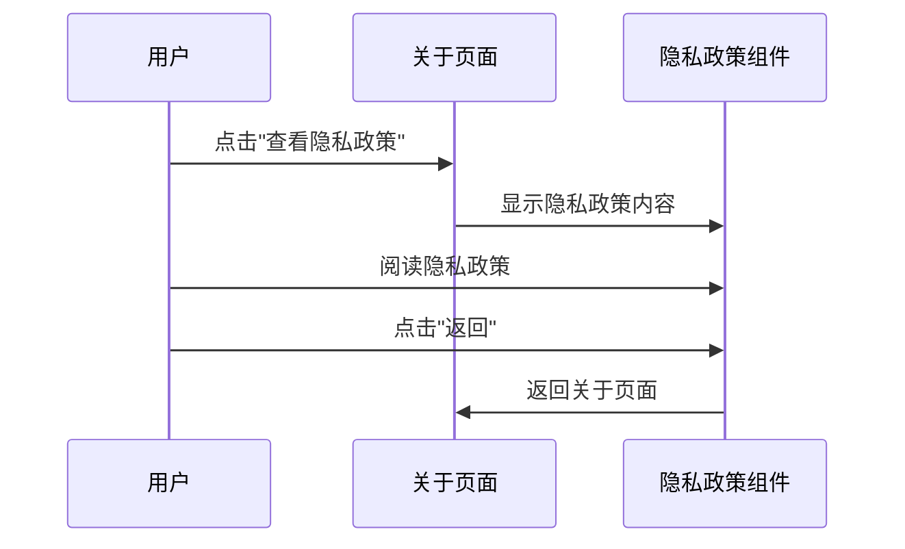
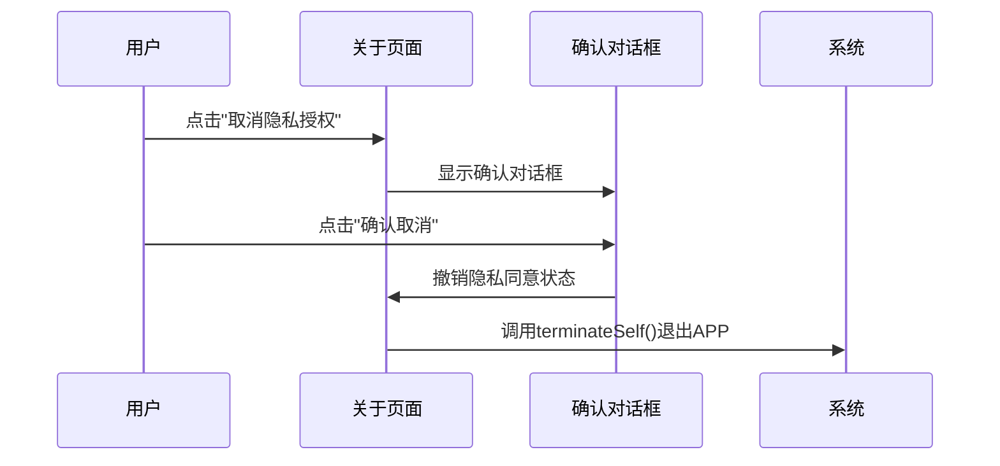

# 隐私政策管理功能设计方案

## 需求概述
在关于页面添加隐私政策管理功能，让用户可以：
1. 随时查看隐私政策
2. 取消隐私授权（撤销同意）
3. 取消授权后APP直接退出
4. 下次打开APP时重新显示隐私政策

## 功能设计

### 关于页面隐私政策管理区域


### 交互流程设计

#### 查看隐私政策流程


#### 取消隐私授权流程


## 技术实现方案

### 文件修改清单
1. **`AboutSettingsNavigation.ets`** - 添加隐私政策管理功能
2. **`string.json`** - 添加新的字符串资源
3. **`PrivacyPolicyDialog.ets`** - 扩展支持查看模式

### 关于页面功能设计

#### 隐私政策管理区域结构
```typescript
// 隐私政策管理卡片
Column({ space: 8 }) {
  // 查看隐私政策
  Row({ space: 8 }) {
    Image($r('app.media.ic_info'))
    Text('查看隐私政策')
    Blank()
  }
  .onClick(() => this.showPrivacyPolicy())
  
  // 取消隐私授权
  Row({ space: 8 }) {
    Image($r('app.media.ic_lock'))
    Text('取消隐私授权')
    Blank()
  }
  .onClick(() => this.revokePrivacyAgreement())
}
```

#### 查看隐私政策功能
- 使用现有的 `PrivacyPolicyDialog` 组件
- 添加查看模式，隐藏操作按钮
- 只显示内容和返回按钮

#### 取消隐私授权功能
1. 显示确认对话框
2. 撤销 `privacy_agreed` 状态
3. 调用 `terminateSelf()` 退出APP

### 字符串资源更新
需要添加以下字符串资源：
- `privacy_policy_management_title` - "隐私政策管理"
- `view_privacy_policy` - "查看隐私政策"
- `revoke_privacy_agreement` - "取消隐私授权"
- `revoke_privacy_confirm_title` - "确认取消隐私授权"
- `revoke_privacy_confirm_message` - "取消隐私授权后，应用将立即退出。下次打开应用时需要重新同意隐私政策才能使用。"
- `revoke_privacy_confirm_button` - "确认取消"
- `revoke_privacy_cancel_button` - "取消"

### 退出APP实现
使用 `UIAbilityContext.terminateSelf()` 方法：
```typescript
const context = getContext(this) as common.UIAbilityContext;
context.terminateSelf();
```

## 用户体验设计

### 查看隐私政策
- 提供完整的隐私政策内容
- 支持滚动查看
- 清晰的返回导航

### 取消隐私授权
- 二次确认防止误操作
- 明确的后果说明
- 立即退出确保数据安全

### 状态管理
- 撤销同意后清除 `privacy_agreed` 状态
- 下次启动强制显示隐私政策
- 确保用户必须重新同意才能使用

## 安全考虑
1. **数据保护**：取消授权后立即退出，防止继续使用
2. **状态一致性**：确保隐私状态与用户操作一致
3. **误操作防护**：通过确认对话框防止意外取消

## 测试场景

### 场景1：查看隐私政策
1. 进入关于页面
2. 点击"查看隐私政策"
3. 验证显示隐私政策内容
4. 点击返回验证正常返回

### 场景2：取消隐私授权
1. 进入关于页面
2. 点击"取消隐私授权"
3. 在确认对话框中点击"确认取消"
4. 验证APP退出
5. 重新启动APP验证显示隐私政策

### 场景3：取消操作
1. 进入关于页面
2. 点击"取消隐私授权"
3. 在确认对话框中点击"取消"
4. 验证返回关于页面，状态不变

## 实施步骤
1. 更新 `AboutSettingsNavigation.ets` 添加管理功能
2. 扩展 `string.json` 添加字符串资源
3. 修改 `PrivacyPolicyDialog.ets` 支持查看模式
4. 测试完整功能流程
5. 验证状态管理和退出逻辑

## 后续优化
1. 添加隐私政策版本管理
2. 支持隐私政策更新通知
3. 添加使用统计和数据分析说明
4. 支持多语言国际化