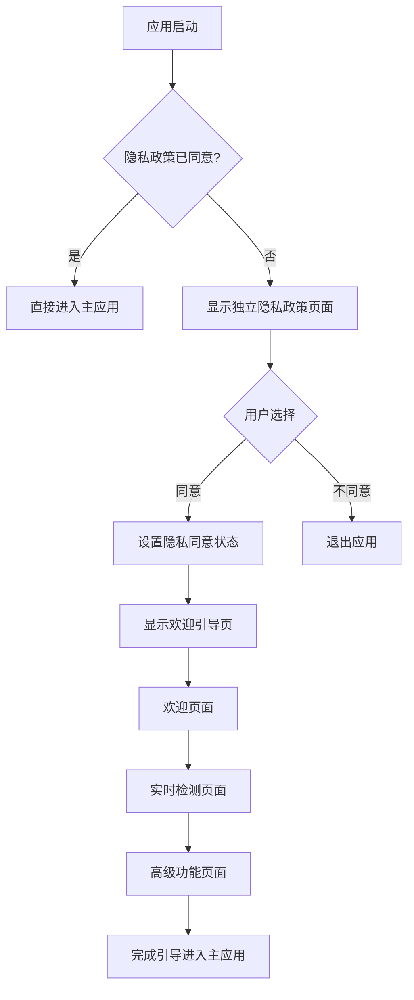

# 隐私政策与欢迎引导分离实现计划

## 问题分析

当前应用启动流程存在以下问题：

1. **流程顺序错误**：隐私政策作为欢迎引导的最后一个页面展示
2. **违反开发规范**：隐私政策应该在应用启动时立即展示
3. **用户体验不佳**：用户需要浏览完所有欢迎页面才能看到隐私政策

## 新的应用启动流程设计

### 流程图


## 具体实现步骤

### 1. 修改 Index.ets 导航逻辑

**当前代码位置**：`entry/src/main/ets/pages/Index.ets:242-256`

**需要修改的逻辑**：
- 当 `pk.privacy_agreed` 为 false 时，先显示独立隐私政策
- 只有用户同意隐私政策后，才显示欢迎引导页

**修改方案**：
```typescript
// 当前代码
if (this.pk.privacy_agreed) {
    MainPage()
} else {
    WelcomeGuide({
        onComplete: () => {
            this.pk.privacy_agreed = true;
        },
        onCancel: () => {
            this.context.terminateSelf();
        }
    })
}

// 修改后代码
if (this.pk.privacy_agreed) {
    MainPage()
} else {
    PrivacyPolicyStandalone({
        onAgree: () => {
            this.pk.privacy_agreed = true;
            // 隐私政策同意后显示欢迎引导
            this.showWelcomeGuide = true;
        },
        onCancel: () => {
            this.context.terminateSelf();
        }
    })
    
    if (this.showWelcomeGuide) {
        WelcomeGuide({
            onComplete: () => {
                // 欢迎引导完成，进入主应用
            },
            onCancel: () => {
                this.context.terminateSelf();
            }
        })
    }
}
```

### 2. 创建独立隐私政策组件

**组件位置**：`entry/src/main/ets/components/privacy/PrivacyPolicyStandalone.ets`

**组件特性**：
- 基于现有的 `PrivacyPolicyPage` 组件
- 移除页面切换功能
- 添加强制同意机制
- 不同意则退出应用

**关键代码结构**：
```typescript
@ComponentV2
export struct PrivacyPolicyStandalone {
  @Event onAgree: () => void;
  @Event onCancel: () => void;
  
  @Local private privacyAgreed: boolean = false;
  
  // 构建内容区域
  @Builder
  private buildContent() {
    // 使用 PrivacyPolicyPage 的内容，但移除页面切换功能
  }
  
  // 构建操作按钮
  @Builder
  private buildActionButtons() {
    // 只有同意按钮和退出按钮
    // 不同意则直接退出应用
  }
}
```

### 3. 修改 WelcomeGuide.ets

**需要移除的内容**：
- 移除隐私政策页面（第4页）
- 调整总页面数为3
- 更新页面切换逻辑

**修改位置**：
- `WelcomeGuide.ets:13` - 修改 `totalPages` 为 3
- `WelcomeGuide.ets:174-182` - 移除隐私政策页面构建逻辑
- `WelcomeGuide.ets:160-183` - 更新 `buildCurrentPage` 方法

### 4. 状态管理更新

**新增状态变量**：
- `showWelcomeGuide: boolean` - 控制是否显示欢迎引导
- 在隐私政策同意后设置为 true

**导航流程控制**：
- 应用启动 → 检查隐私政策状态
- 未同意 → 显示独立隐私政策
- 同意 → 设置 `showWelcomeGuide = true`
- 显示欢迎引导 → 完成引导 → 进入主应用

## 文件修改清单

### 需要创建的文件
1. `entry/src/main/ets/components/privacy/PrivacyPolicyStandalone.ets`

### 需要修改的文件
1. `entry/src/main/ets/pages/Index.ets` - 导航逻辑
2. `entry/src/main/ets/components/welcome/WelcomeGuide.ets` - 移除隐私政策页面
3. `entry/src/main/ets/components/welcome/index.ets` - 导出新组件

### 需要更新的导入
- 在 `Index.ets` 中导入 `PrivacyPolicyStandalone` 组件
- 更新 `WelcomeGuide` 的页面数量逻辑

## 用户体验优化

### 动画效果
- 隐私政策页面使用渐入动画
- 页面切换保持现有的滑动效果
- 同意按钮添加点击反馈

### 交互设计
- 隐私政策必须同意才能继续
- 不同意选项明确提示退出应用
- 欢迎引导保持现有的滑动交互

## 测试要点

1. **首次启动测试**：确保先显示隐私政策
2. **同意流程测试**：隐私政策同意后显示欢迎引导
3. **拒绝流程测试**：不同意隐私政策时退出应用
4. **重复启动测试**：已同意隐私政策时直接进入主应用
5. **页面切换测试**：欢迎引导页面切换正常

## 风险控制

1. **向后兼容**：保持现有的数据存储格式
2. **错误处理**：添加适当的错误处理机制
3. **性能考虑**：避免不必要的重渲染
4. **代码维护**：保持代码清晰和可读性