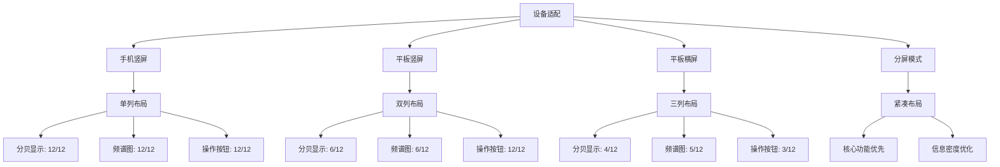

# 平板兼容性优化设计方案

## 📋 项目概述

本方案针对噪音检测应用在平板设备上的兼容性问题，提供完整的响应式布局优化方案，支持平板横屏、分屏模式和画中画功能。

## 🔍 问题分析

### 当前布局问题
1. **分贝显示面板过小**：在平板横屏下只占5/12网格，显示不全
2. **频谱图过度拉伸**：Canvas尺寸计算未考虑横屏模式，导致变形
3. **操作按钮位置异常**：条件渲染逻辑混乱，按钮显示在频谱图上层
4. **布局重叠**：组件间存在遮挡和重叠现象

### 技术根源
- 网格系统span配置不合理
- Canvas尺寸计算逻辑缺陷
- 操作按钮布局策略不完善
- 缺乏针对平板横屏的专门优化

## 🎯 设计目标

### 核心目标
1. **完美适配平板横屏**：优化三列布局，合理分配空间
2. **支持多任务模式**：分屏和画中画功能支持
3. **提升用户体验**：增大点击区域，优化视觉层次
4. **保持性能**：响应式布局不影响应用性能

### 技术指标
- 支持600-2000dp宽度的平板设备
- 横竖屏切换响应时间 < 200ms
- 内存使用增加 < 5%
- 向后兼容现有手机布局

## 🎨 UI/UX设计方案

### 布局策略



### 组件优化细节

#### 1. 分贝显示组件
- **字体响应式**：
  - 手机：80-90px
  - 平板竖屏：100px
  - 平板横屏：120px
- **布局优化**：统计信息水平排列，提升信息密度
- **视觉增强**：卡片式设计，更好的视觉层次

#### 2. 频谱图组件
- **宽高比自适应**：
  - 竖屏：1.5:1
  - 横屏：2:1
- **尺寸计算**：基于可用空间动态计算
- **性能优化**：频谱密度根据屏幕尺寸调整

#### 3. 操作面板
- **布局策略**：
  - 手机：垂直排列
  - 平板：水平网格排列
- **按钮尺寸**：从40px增加到48px
- **交互优化**：增大点击区域，支持手势操作

## 🔧 技术实现方案

### 核心修改文件

#### 1. DecibelMeter.ets - 主布局重构
```typescript
// 新的网格配置
GridRow({ columns: 12, breakpoints: { reference: BreakpointsReference.WindowSize }, gutter: 16 }) {
  // 分贝显示面板
  GridCol({
    span: {
      xs: 12,  // 手机竖屏
      sm: 12,  // 手机横屏  
      md: 6,   // 平板竖屏
      lg: 4,   // 平板横屏
      xl: 4    // 大屏设备
    }
  }) {
    DecibelDisplayComponent({...})
  }
  
  // 频谱图
  GridCol({
    span: {
      xs: 12,
      sm: 12, 
      md: 6,
      lg: 5,
      xl: 5
    }
  }) {
    SpectrumChartComponent({...})
  }
  
  // 操作面板
  GridCol({
    span: {
      xs: 12,
      sm: 12,
      md: 12,
      lg: 3, 
      xl: 3
    }
  }) {
    ActionPanel({...})
  }
}
```

#### 2. DecibelDisplayComponent.ets - 响应式字体优化
```typescript
// 综合布局模式判断
private getLayoutMode(): LayoutMode {
  const widthBp = this.as.windowWidthBreakpoint;
  const heightBp = this.as.windowHeightBreakpoint;
  const isLandscape = this.as.isLandscape;
  
  // 平板横屏模式判断
  if (widthBp >= 2 && isLandscape) { // WIDTH_MD及以上且横屏
    return LayoutMode.TABLET_LANDSCAPE;
  }
  
  // 平板竖屏模式判断
  if (widthBp >= 2 && !isLandscape) { // WIDTH_MD及以上且竖屏
    return LayoutMode.TABLET_PORTRAIT;
  }
  
  // 手机横屏模式判断
  if (widthBp < 2 && isLandscape) { // WIDTH_SM及以下且横屏
    return LayoutMode.PHONE_LANDSCAPE;
  }
  
  // 默认手机竖屏模式
  return LayoutMode.PHONE_PORTRAIT;
}
```

#### 3. SpectrumChartComponent.ets - Canvas优化
```typescript
// 响应式尺寸计算
private calculateCanvasDimensions(): void {
  const display = display.getDefaultDisplaySync();
  const isLandscape = display.width > display.height;
  
  if (isLandscape) {
    // 横屏模式：2:1宽高比
    this.canvasWidth = availableWidth * 0.8;
    this.canvasHeight = this.canvasWidth / 2;
  } else {
    // 竖屏模式：1.5:1宽高比  
    this.canvasWidth = availableWidth * 0.9;
    this.canvasHeight = this.canvasWidth / 1.5;
  }
}
```

#### 3. ActionPanel.ets - 按钮布局重构
```typescript
// 响应式按钮布局
build() {
  const layout = this.getButtonLayout(this.breakPoint);
  
  Flex({
    direction: layout.direction,
    wrap: layout.wrap,
    justifyContent: FlexAlign.SpaceEvenly,
    alignItems: ItemAlign.Center
  }) {
    // 按钮组件
    ForEach(this.actions, (action) => {
      this.ActionButton(action)
    })
  }
  .width('100%')
  .padding(12)
}
```

### 高级功能实现

#### 画中画模式
```typescript
// 画中画管理器
class PictureInPictureManager {
  private isPipMode: boolean = false;
  
  // 进入画中画模式
  enterPipMode(): void {
    this.isPipMode = true;
    this.optimizeLayoutForPip();
    this.startFloatingWindow();
  }
  
  // 优化画中画布局
  private optimizeLayoutForPip(): void {
    // 隐藏非核心组件
    // 简化频谱显示
    // 调整字体大小
  }
}
```

#### 分屏模式适配
```typescript
// 分屏检测
const detectSplitScreen = (): SplitScreenMode => {
  const availableWidth = display.getDefaultDisplaySync().width;
  
  if (availableWidth < 400) return SplitScreenMode.COMPACT;
  if (availableWidth < 600) return SplitScreenMode.MEDIUM;
  if (availableWidth < 800) return SplitScreenMode.LARGE;
  return SplitScreenMode.FULL;
}
```

## 📊 实施计划

### 第一阶段：核心布局修复（3-5天）
1. **网格系统重构** - 优化span配置
2. **分贝显示优化** - 响应式字体和布局
3. **频谱图自适应** - Canvas尺寸计算优化

### 第二阶段：响应式增强（4-6天）
1. **操作按钮重构** - 智能布局策略
2. **断点系统完善** - 增强设备检测
3. **动画过渡效果** - 布局切换动画

### 第三阶段：高级功能（5-7天）
1. **画中画模式** - 紧凑布局和浮动窗口
2. **分屏模式适配** - 多任务优化
3. **测试和优化** - 全面测试和性能调优

## 🧪 测试方案

### 设备覆盖
- **手机**：320-480dp宽度
- **平板竖屏**：600-800dp宽度  
- **平板横屏**：800-1200dp宽度
- **大屏设备**：1200-2000dp宽度

### 测试场景
1. **横竖屏切换**：布局平滑过渡
2. **分屏模式**：与其他应用协同
3. **画中画模式**：浮动窗口功能
4. **性能测试**：内存和CPU使用

### 验收标准
- 所有组件在平板横屏下正常显示
- 布局切换无闪烁或跳动
- 点击区域符合人机工程学
- 性能指标在可接受范围内

## ⚠️ 风险评估

### 技术风险
1. **兼容性问题**：旧设备可能不支持新布局
2. **性能影响**：响应式计算可能增加CPU负担
3. **代码复杂度**：多布局策略增加维护难度

### 应对措施
1. **渐进式增强**：基础功能保持兼容
2. **性能优化**：使用缓存和防抖机制
3. **代码模块化**：清晰的布局策略分离

## 📈 成功指标

### 用户体验指标
- 平板横屏布局满意度 > 90%
- 操作成功率 > 95%
- 布局切换满意度 > 85%

### 技术指标
- 布局计算时间 < 50ms
- 内存使用增加 < 10MB
- 兼容设备覆盖率 > 95%

## 🔄 维护计划

### 持续优化
1. **用户反馈收集**：定期收集平板用户反馈
2. **性能监控**：监控布局计算性能
3. **设备适配**：支持新设备尺寸和特性

### 版本规划
- **v1.0**：基础平板兼容性
- **v1.1**：画中画和分屏功能
- **v1.2**：高级交互和动画优化

---

*本方案将持续更新，根据实际实施情况和用户反馈进行调整优化。*