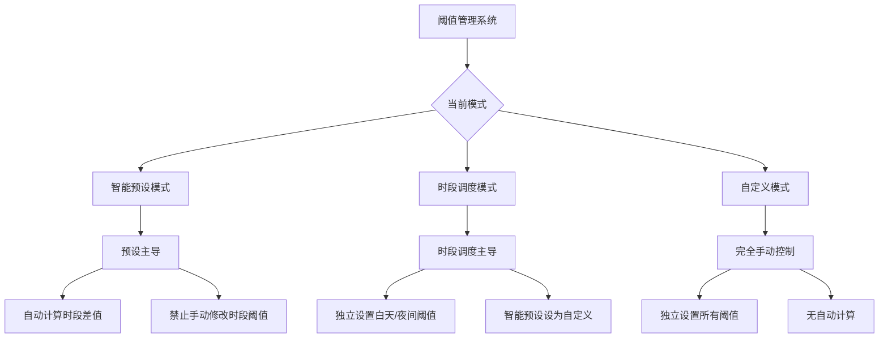

# 阈值管理优化方案实施文档

## 问题背景

原噪音计应用中的智能预设和时段调度功能存在逻辑冲突：
- 智能预设：基于环境类型的预设阈值
- 时段调度：基于时间段的动态阈值
- 两者都可以独立修改阈值，导致状态冲突和用户困惑

## 解决方案：分层架构设计

### 核心设计理念
采用**模式驱动**的阈值管理架构，明确不同模式下的行为规则：



### 三种模式定义

#### 1. 智能预设模式
- **行为**：预设主导，时段调度自动计算
- **特点**：
  - 选择环境类型（安静/一般/嘈杂/危险）
  - 时段调度阈值自动基于预设计算
  - 禁止手动修改时段阈值
  - 提供"解锁编辑"选项切换到自定义模式

#### 2. 时段调度模式
- **行为**：独立设置白天/夜间阈值
- **特点**：
  - 完全独立控制白天和夜间阈值
  - 智能预设自动设为"自定义"
  - 适合需要精细控制不同时段阈值的用户

#### 3. 自定义模式
- **行为**：完全手动控制
- **特点**：
  - 独立设置基准阈值和时段阈值
  - 无自动计算逻辑
  - 提供最大灵活性

## 技术实现

### 核心文件结构

```
entry/src/main/ets/
├── models/ThresholdConfig.ets          # 阈值配置模型定义
├── services/ThresholdManager.ets       # 阈值管理器服务
└── components/alerts/
    └── EnhancedThresholdManager.ets    # 增强型阈值管理组件
```

### 关键特性

#### 1. 状态同步机制
- **单向数据流**：模式决定数据流向
- **状态验证**：确保阈值设置的合理性
- **冲突解决**：明确优先级规则
- **自动模式切换**：当用户手动修改时段阈值时自动切换到自定义模式

#### 2. 智能计算算法
```typescript
// 基于基准阈值智能计算差值
private getThresholdDifference(baseThreshold: number): number {
  if (baseThreshold <= 40) return 5;   // 安静环境
  if (baseThreshold <= 55) return 10;  // 一般环境  
  if (baseThreshold <= 70) return 15;  // 嘈杂环境
  return 20;                           // 危险环境
}
```

#### 3. 用户界面优化
- **模式指示器**：清晰显示当前模式
- **操作限制提示**：在智能预设模式下提示"时段阈值已自动计算"
- **状态变更确认**：模式切换时确认用户意图
- **实时反馈**：显示当前有效阈值和时段状态

## 优势分析

### 1. 逻辑清晰
- 每种模式有明确的行为规则
- 消除功能冲突和用户困惑
- 提供一致的交互体验

### 2. 用户体验优化
- 减少决策负担，提供明确指引
- 渐进式复杂度，从简单到复杂
- 直观的视觉反馈和状态提示

### 3. 技术优势
- 扩展性强：易于添加新的阈值管理策略
- 维护性好：状态管理集中，bug易于定位
- 性能优化：减少不必要的状态同步

## 实施步骤

### 第一阶段：核心架构（已完成）
- [x] 设计阈值配置模型
- [x] 实现阈值管理器服务
- [x] 创建增强型阈值管理组件

### 第二阶段：界面集成（已完成）
- [x] 更新警报设置页面
- [x] 替换原有冲突组件
- [x] 测试基本功能

### 第三阶段：测试优化（待完成）
- [ ] 测试不同场景下的功能一致性
- [ ] 收集用户反馈进行迭代优化
- [ ] 性能测试和优化

## 使用指南

### 智能预设模式（推荐新手）
1. 选择环境类型（安静/一般/嘈杂/危险）
2. 系统自动计算并设置时段调度阈值
3. 如需自定义，点击"解锁编辑"切换到自定义模式

### 时段调度模式（适合精细控制）
1. 独立设置白天和夜间阈值
2. 系统自动切换到自定义预设
3. 适合需要不同时段不同敏感度的场景

### 自定义模式（完全控制）
1. 手动设置所有阈值参数
2. 无自动计算，完全用户控制
3. 适合专业用户和特殊需求

## 兼容性考虑

### 向后兼容
- 保留原有配置数据的迁移路径
- 提供默认配置确保平滑升级
- 兼容原有的警报触发逻辑

### 向前扩展
- 支持添加新的预设类型
- 可扩展时段调度配置
- 支持用户自定义预设

## 风险评估与缓解

### 风险点
1. **用户习惯改变**：现有用户可能需要适应新模式
2. **复杂状态同步**：可能引入新的bug
3. **性能影响**：实时阈值计算可能影响性能

### 缓解措施
1. **渐进式改进**：保留原有功能，逐步引导
2. **充分测试**：全面的测试覆盖
3. **性能监控**：实时监控和优化

## 总结

新的分层架构设计成功解决了智能预设和时段调度的功能冲突问题，通过明确的模式划分和智能状态同步机制，提供了更清晰、更易用的阈值管理体验。该方案既保持了功能的强大性，又降低了用户的使用复杂度，是解决此类功能冲突问题的优秀实践。