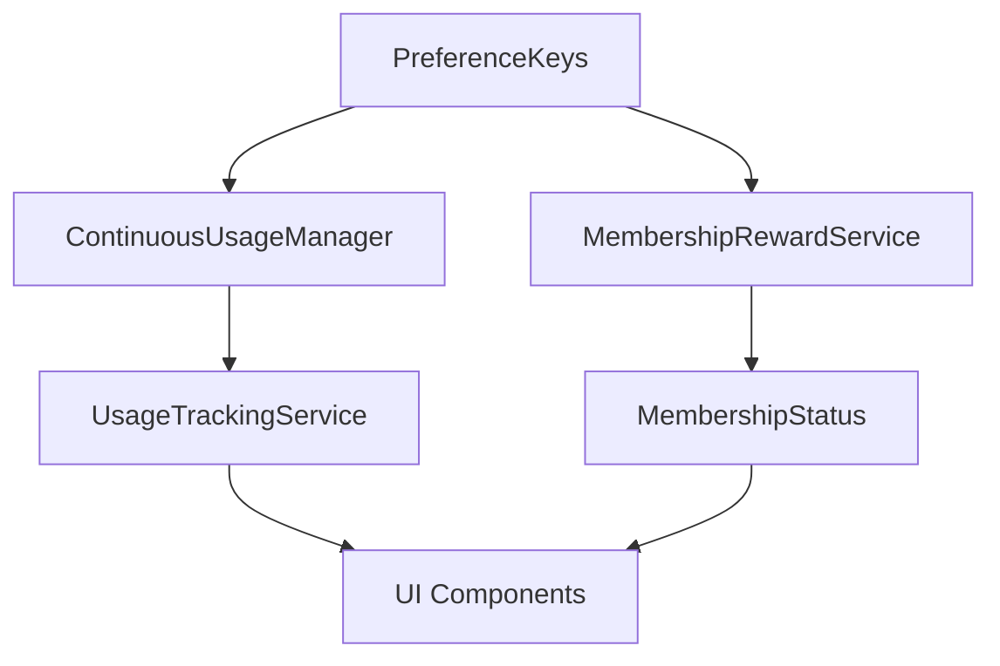

# 使用APP送会员功能 - 代码实现方案

## 📋 项目概述

### 功能目标
用户每天首次打开APP并持续使用1分钟，根据连续使用天数赠送会员，采用里程碑奖励机制。

### 技术架构


## 🏗️ 核心服务设计

### 1. ContinuousUsageManager.ets - 连续使用天数管理

```typescript
// 连续使用数据结构
interface ContinuousUsageData {
  lastUsageDate: string;        // 最后使用日期 "YYYY-MM-DD"
  consecutiveDays: number;      // 连续天数
  todayUsageCompleted: boolean; // 今天是否已完成使用
  totalUsageSeconds: number;    // 今日累计使用秒数
}

// 连续天数计算规则
export class ContinuousUsageManager {
  private static instance: ContinuousUsageManager;
  
  // 检查并更新连续天数
  public checkAndUpdateConsecutiveDays(): number;
  
  // 记录今日使用完成
  public markTodayUsageCompleted(): void;
  
  // 获取连续天数
  public getConsecutiveDays(): number;
  
  // 检查是否断签
  private checkIfBreakChain(currentDate: string): boolean;
}
```

### 2. UsageTrackingService.ets - 使用时长追踪服务

```typescript
export class UsageTrackingService {
  private static instance: UsageTrackingService;
  private usageTimer: number = 0;
  private currentSeconds: number = 0;
  private isTracking: boolean = false;
  
  // 开始追踪使用时长
  public startTracking(): void;
  
  // 暂停追踪（APP进入后台）
  public pauseTracking(): void;
  
  // 恢复追踪（APP回到前台）
  public resumeTracking(): void;
  
  // 停止追踪
  public stopTracking(): void;
  
  // 获取当前使用秒数
  public getCurrentSeconds(): number;
  
  // 检查是否完成今日使用
  public isTodayUsageCompleted(): boolean;
}
```

### 3. MembershipRewardService.ets - 会员赠送服务

```typescript
// 里程碑奖励规则
const MILESTONE_REWARDS = {
  1: 1,   // 连续1天 → 1天
  2: 2,   // 连续2天 → 2天
  3: 5,   // 连续3天 → 5天
  4: 3,   // 连续4天 → 3天
  5: 4,   // 连续5天 → 4天
  6: 5,   // 连续6天 → 5天
  7: 10,  // 连续7天 → 10天
  8: 5,   // 连续8天 → 5天
  9: 6,   // 连续9天 → 6天
  10: 15, // 连续10天 → 15天
  15: 30, // 连续15天 → 30天
  30: 60  // 连续30天 → 60天
};

export class MembershipRewardService {
  private static instance: MembershipRewardService;
  
  // 计算应赠送会员天数
  public calculateRewardDays(consecutiveDays: number): number;
  
  // 应用会员奖励
  public applyMembershipReward(consecutiveDays: number): void;
  
  // 获取明日奖励预告
  public getTomorrowRewardPreview(consecutiveDays: number): number;
  
  // 获取下一个里程碑
  public getNextMilestone(consecutiveDays: number): { days: number, reward: number };
}
```

## 📝 数据结构扩展

### PreferenceKeys.ets 扩展字段

```typescript
@ObservedV2
export class PreferenceKeys {
  // 现有字段...
  
  // 新增连续使用相关字段 - 必须使用@ObservedV2类
  @Trace
  continuous_usage_data: ContinuousUsageData = new ContinuousUsageData();
  
  @Trace
  last_app_foreground_time: number = 0; // 最后进入前台时间
  
  @Trace
  total_app_usage_today: number = 0; // 今日累计使用秒数
}
```

### ContinuousUsageData 类定义

```typescript
/**
 * 连续使用数据类
 * 必须使用@ObservedV2注解，内部属性使用@Trace注解
 * 这样才能确保UI响应式更新
 */
@ObservedV2
export class ContinuousUsageData {
  @Trace lastUsageDate: string = '';
  @Trace consecutiveDays: number = 0;
  @Trace todayUsageCompleted: boolean = false;
  @Trace totalUsageSeconds: number = 0;
  
  constructor(
    lastUsageDate: string = '',
    consecutiveDays: number = 0,
    todayUsageCompleted: boolean = false,
    totalUsageSeconds: number = 0
  ) {
    this.lastUsageDate = lastUsageDate;
    this.consecutiveDays = consecutiveDays;
    this.todayUsageCompleted = todayUsageCompleted;
    this.totalUsageSeconds = totalUsageSeconds;
  }
  
  // 重置今日使用数据（每天重置）
  public resetTodayUsage(): void {
    this.todayUsageCompleted = false;
    this.totalUsageSeconds = 0;
  }
  
  // 更新使用秒数
  public updateUsageSeconds(seconds: number): void {
    this.totalUsageSeconds = seconds;
  }
  
  // 标记今日使用完成
  public markTodayCompleted(): void {
    this.todayUsageCompleted = true;
  }
}
```

## 🎨 UI组件设计

### 1. MembershipStatusCard.ets - 会员状态卡片

```typescript
@ComponentV2
export struct MembershipStatusCard {
  @Local pk: PreferenceKeys = PersistenceV2.connect(PreferenceKeys)!;
  @Local currentSeconds: number = 0;
  @Local progressPercent: number = 0;
  
  @Builder
  private buildMembershipHeader() {
    // 显示会员等级、剩余天数、连续天数
  }
  
  @Builder
  private buildUsageProgress() {
    // 显示使用进度条和倒计时
  }
  
  @Builder
  private buildRewardPreview() {
    // 显示今日奖励、明日奖励、里程碑提示
  }
  
  build() {
    Column({ space: DesignConstants.SPACING_MD }) {
      this.buildMembershipHeader()
      this.buildUsageProgress()
      this.buildRewardPreview()
    }
  }
}
```

### 2. UsageProgressComponent.ets - 使用进度组件

```typescript
@ComponentV2
export struct UsageProgressComponent {
  @Param currentSeconds: number;
  @Param totalSeconds: number = 60;
  @Param consecutiveDays: number;
  @Param rewardDays: number;
  
  @Builder
  private buildProgressBar() {
    // 进度条显示
  }
  
  @Builder
  private buildCountdownText() {
    // 倒计时文字
  }
  
  build() {
    Column({ space: DesignConstants.SPACING_SM }) {
      this.buildProgressBar()
      this.buildCountdownText()
    }
  }
}
```

### 3. RewardCompletionDialog.ets - 奖励完成弹窗

```typescript
@ComponentV2
export struct RewardCompletionDialog {
  @Param consecutiveDays: number;
  @Param rewardDays: number;
  @Param expiryDate: number;
  @Event onClose: () => void;
  
  build() {
    // 庆祝弹窗内容
  }
}
```

## 🔄 集成方案

### 1. Index.ets 初始化集成

```typescript
// 在 aboutToAppear 中添加
async aboutToAppear() {
  // 现有初始化代码...
  
  // 初始化使用追踪服务
  const usageTrackingService = UsageTrackingService.getInstance();
  usageTrackingService.initialize();
  
  // 检查连续使用天数
  const continuousUsageManager = ContinuousUsageManager.getInstance();
  continuousUsageManager.checkAndUpdateConsecutiveDays();
}
```

### 2. NoiseMeterNavigation.ets 标题栏集成

```typescript
// 在标题栏右侧添加会员状态
@Builder
private buildMembershipBadge() {
  if (this.pk.member_ship.can()) {
    // 显示专业会员徽章和剩余天数
  } else {
    // 显示免费用户徽章
  }
}
```

### 3. MyContentComponent.ets 集成会员状态卡片

```typescript
@Builder
private buildMembershipSection() {
  MembershipStatusCard()
    .margin({ top: DesignConstants.SPACING_MD })
}
```

## 🚀 核心业务流程

### 1. APP启动流程
```typescript
// 1. 检查连续使用天数
const consecutiveDays = continuousUsageManager.checkAndUpdateConsecutiveDays();

// 2. 初始化使用追踪
usageTrackingService.startTracking();

// 3. 更新UI状态
this.updateMembershipUI();
```

### 2. 使用时长追踪流程
```typescript
// 每秒更新使用秒数
this.currentSeconds = usageTrackingService.getCurrentSeconds();

// 检查是否完成使用
if (this.currentSeconds >= 60 && !this.pk.continuous_usage_data.todayUsageCompleted) {
  // 标记今日使用完成
  continuousUsageManager.markTodayUsageCompleted();
  
  // 应用会员奖励
  const rewardDays = membershipRewardService.calculateRewardDays(consecutiveDays);
  membershipRewardService.applyMembershipReward(consecutiveDays);
  
  // 显示完成弹窗
  this.showRewardCompletionDialog();
}
```

### 3. 前后台状态处理
```typescript
// APP进入后台
onBackground(): void {
  usageTrackingService.pauseTracking();
}

// APP回到前台
onForeground(): void {
  usageTrackingService.resumeTracking();
}
```

## 🔧 关键技术实现要点

### 1. 响应式数据绑定
```typescript
// UI组件中使用@Monitor监听数据变化
@Monitor('pk.continuous_usage_data.totalUsageSeconds')
onUsageSecondsChange(monitor: IMonitor) {
  const seconds = monitor.value<number>()?.now!;
  this.updateProgressBar(seconds);
}

@Monitor('pk.member_ship.expiryDate')
onMembershipChange(monitor: IMonitor) {
  this.updateMembershipStatus();
}
```

### 2. 日期处理逻辑
```typescript
// 获取今天日期字符串
private getTodayDateString(): string {
  const now = new Date();
  return `${now.getFullYear()}-${(now.getMonth() + 1).toString().padStart(2, '0')}-${now.getDate().toString().padStart(2, '0')}`;
}

// 检查是否连续使用
private isConsecutiveDay(lastDate: string, currentDate: string): boolean {
  const last = new Date(lastDate);
  const current = new Date(currentDate);
  const diffTime = current.getTime() - last.getTime();
  const diffDays = Math.ceil(diffTime / (1000 * 60 * 60 * 24));
  return diffDays === 1;
}
```

### 3. 定时器管理
```typescript
// 使用setInterval进行秒级更新
private startUsageTimer(): void {
  this.usageTimer = setInterval(() => {
    if (this.isTracking) {
      this.currentSeconds++;
      this.notifySecondsChange(this.currentSeconds);
      
      // 每10秒自动保存进度
      if (this.currentSeconds % 10 === 0) {
        this.saveUsageProgress();
      }
    }
  }, 1000);
}

// 清理定时器
private stopUsageTimer(): void {
  if (this.usageTimer) {
    clearInterval(this.usageTimer);
    this.usageTimer = 0;
  }
}
```

### 4. 错误处理和边界情况
```typescript
// 处理日期异常
private handleDateException(lastDate: string): void {
  console.warn('检测到日期数据异常，重置连续使用天数');
  this.pk.continuous_usage_data.consecutiveDays = 1;
  this.pk.continuous_usage_data.lastUsageDate = this.getTodayDateString();
}

// 处理使用时长异常
private handleUsageTimeException(): void {
  // 如果使用时长异常大，可能是系统时间被修改
  if (this.currentSeconds > 3600) { // 超过1小时
    console.warn('检测到使用时长异常，重置今日使用数据');
    this.pk.continuous_usage_data.resetTodayUsage();
    this.currentSeconds = 0;
  }
}
```

### 5. 数据持久化策略
```typescript
// 自动保存使用进度
private saveUsageProgress(): void {
  // 使用PersistenceV2自动持久化@Trace注解的数据
  // 不需要手动保存，系统会自动处理
}

// 初始化时恢复数据
private restoreUsageData(): void {
  // PersistenceV2会自动从存储中恢复数据
  // 只需要检查数据有效性
  if (!this.pk.continuous_usage_data.lastUsageDate) {
    // 首次使用，初始化数据
    this.pk.continuous_usage_data.lastUsageDate = this.getTodayDateString();
    this.pk.continuous_usage_data.consecutiveDays = 0;
  }
}
```

## 🎯 总结

这个代码架构方案确保了：
1. **响应式数据流**：使用@ObservedV2和@Trace实现自动UI更新
2. **可靠的状态管理**：处理各种边界情况和异常
3. **良好的用户体验**：实时进度显示和及时反馈
4. **可维护的代码结构**：清晰的职责分离和模块化设计
5. **性能优化**：合理的定时器管理和数据持久化策略

所有核心服务都采用单例模式，确保全局状态一致性，同时通过事件监听机制实现松耦合的组件通信。

## 🧪 测试方案

### 单元测试覆盖
- 连续天数计算逻辑测试
- 里程碑奖励规则测试
- 使用时长追踪准确性测试
- 前后台状态切换测试

### 集成测试场景
- 正常连续使用场景
- 断签后重新开始场景
- 跨天使用场景
- 边界条件测试（59秒、61秒等）

## 📊 性能考虑

### 内存优化
- 使用单例模式管理服务
- 定时器及时清理
- 状态变化时最小化UI更新

### 电池优化
- 后台时暂停计时
- 使用系统级的时间管理
- 避免不必要的状态持久化

这个代码架构方案确保了功能的可靠性、可维护性和良好的用户体验。