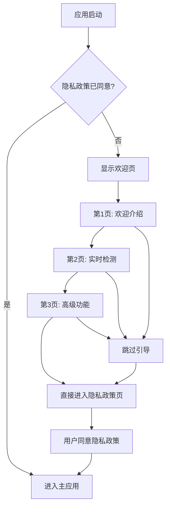

# 欢迎页最终集成方案

## 正确的集成逻辑

### 应用启动流程


### 修改Index.ets的正确代码

```typescript
// 在Index.ets的build方法中
build() {
  Column() {
    Column().id('mainId');
    if (this.isLoading) {
      // 加载中状态
      this.buildLoadingState()
    } else if (!this.isInitialized) {
      // 错误状态
      this.buildErrorState()
    } else {
      // 正常内容
      Navigation(this.navStack) {
        if (this.pk.privacy_agreed) {
          // 隐私政策已同意，直接进入主应用
          MainPage()
        } else {
          // 隐私政策未同意，显示欢迎页（包含隐私政策）
          WelcomeGuideBuilder({
            onComplete: () => {
              // 用户在欢迎页的最后一页同意了隐私政策
              this.pk.privacy_agreed = true;
              // 进入主应用
              MainPage()
            },
            onCancel: () => {
              // 用户取消，退出APP
              this.context.terminateSelf();
            }
          })
        }
      }
      .size({ width: '100%' })
      .hideTitleBar(true)
      .titleMode(NavigationTitleMode.Free)
      .backgroundColor($r('sys.color.background_primary'))
      .mode(NavigationMode.Stack)
    }
  }
}
```

### 移除不必要的字段

**不需要在PreferenceKeys中添加 `has_seen_welcome` 字段**，只需要使用现有的 `privacy_agreed` 字段。

### 欢迎页主容器的修改

在 [`WelcomeGuide.ets`](docs/welcome_page_coding_implementation_plan.md) 中，确保 `onComplete` 回调正确设置隐私政策状态：

```typescript
@ComponentV2
export struct WelcomeGuide {
  @Param @Require onComplete: () => void;
  @Param @Require onCancel: () => void;
  
  @Local private currentPage: number = 0;
  @Local private totalPages: number = 4;
  @Local private privacyAgreed: boolean = false;

  private handleComplete(): void {
    if (this.currentPage === this.totalPages - 1 && this.privacyAgreed) {
      // 用户在最后一页同意了隐私政策
      this.onComplete(); // 这会触发Index.ets中的回调
    }
  }

  // ... 其他方法保持不变
}
```

### 隐私政策页的修改

在 [`PrivacyPolicyPage.ets`](docs/welcome_page_coding_implementation_plan_part2.md) 中，确保同意按钮正确触发：

```typescript
@Builder
private buildActionButtons() {
  Column({ space: DesignConstants.SPACING_MD }) {
    // 同意按钮
    Button('同意并开始', { type: ButtonType.Capsule })
      .width('100%')
      .height(56)
      .backgroundColor(this.privacyAgreed ? 
        $r('sys.color.interactive_active') : 
        $r('sys.color.comp_background_primary'))
      .fontColor(this.privacyAgreed ? 
        $r('sys.color.font_on_primary') : 
        $r('sys.color.font_disabled'))
      .fontSize(DesignConstants.FONT_SIZE_LG)
      .enabled(this.privacyAgreed)
      .onClick(() => {
        if (this.privacyAgreed) {
          this.onAgree(); // 这会触发WelcomeGuide中的handleComplete
        }
      })

    // 取消按钮
    Text('取消')
      .fontSize(DesignConstants.FONT_SIZE_MD)
      .fontColor($r('sys.color.font_secondary'))
      .onClick(() => this.onCancel())
  }
  .width('100%')
}
```

## 完整的集成流程

### 第一次启动应用
1. 应用启动，检查 `privacy_agreed` 为 false
2. 显示欢迎页（4页滑动引导）
3. 用户浏览前3页了解应用功能
4. 在第4页同意隐私政策
5. 设置 `privacy_agreed = true`
6. 进入主应用

### 后续启动应用
1. 应用启动，检查 `privacy_agreed` 为 true
2. 直接进入主应用

### 跳过引导的情况
1. 用户在任何页面点击"跳过"
2. 直接跳转到第4页（隐私政策页）
3. 用户同意隐私政策
4. 进入主应用

## 优势

1. **简化逻辑**：只需要一个 `privacy_agreed` 字段
2. **用户体验**：单次同意流程，避免重复操作
3. **合规性**：在用户了解功能后获取同意
4. **灵活性**：用户可以跳过功能介绍直接同意

这个集成方案更加简洁和合理，符合您的需求。