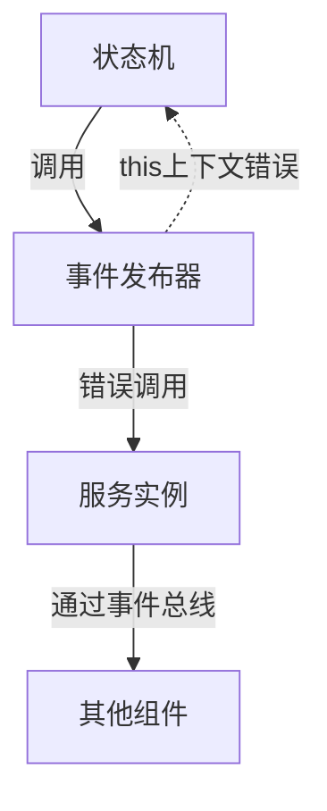

# AudioControllerService 堆栈溢出问题解决方案

## 问题概述

**错误信息：**
```
Stack overflow! at publishEvent entry (entry/src/main/ets/services/AudioControllerService.ets:334:16)
```

**问题位置：**
[`AudioControllerService.ets`](entry/src/main/ets/services/AudioControllerService.ets:334) 第334行

## 根本原因分析

### 问题代码
```typescript
const eventPublisher: AudioControllerEventPublisher = {
  publishEvent(event: AudioControllerEvent): void {
    this.publishEvent(event);  // 第334行 - 无限递归调用
  },
  onEvent(callback: (event: AudioControllerEvent) => void): void {
    this.onEvent(callback);
  }
};
```

### 问题分析
1. **this 上下文丢失**：在对象字面量中，`this` 指向的是 `eventPublisher` 对象本身
2. **无限递归**：`eventPublisher.publishEvent()` 调用 `this.publishEvent()`，但 `this` 指向错误
3. **原型链查找**：JavaScript 沿着原型链查找 `publishEvent` 方法，找到 `AudioControllerService.publishEvent()`
4. **循环调用**：形成 `AudioControllerStateMachine.publishEvent() → eventPublisher.publishEvent() → AudioControllerService.publishEvent()` 的无限循环

## 架构设计问题

### 当前架构缺陷


### 设计问题
1. **循环依赖**：状态机 ↔ 事件发布器 ↔ 服务实例
2. **过度抽象**：事件发布器适配器增加了不必要的复杂性
3. **上下文管理**：对象字面量中的 this 绑定问题

## 解决方案

### 推荐方案：简化事件发布机制

**修复思路：**
- 移除复杂的 `eventPublisher` 适配器
- 让状态机直接访问服务的 `eventSubject`
- 使用箭头函数正确绑定 this 上下文

### 具体实现

**方案一：使用箭头函数绑定 this（推荐）**
```typescript
// 在 initializeStateMachine 方法中
const eventPublisher: AudioControllerEventPublisher = {
  publishEvent: (event: AudioControllerEvent): void => {
    this.eventSubject.next(event);  // 直接使用 eventSubject
  },
  onEvent: (callback: (event: AudioControllerEvent) => void): void => {
    this.eventSubject.subscribe(callback);
  }
};
```

**方案二：简化适配器设计**
```typescript
// 创建简化的事件发布器
const eventPublisher: AudioControllerEventPublisher = {
  publishEvent: this.publishEvent.bind(this),  // 正确绑定 this
  onEvent: this.onEvent.bind(this)
};
```

**方案三：重构为直接访问（最优）**
```typescript
// 修改状态机构造函数，直接传入 eventSubject
this.stateMachine = new AudioControllerStateMachine(this.eventSubject);
```

## 修复步骤

### 步骤 1：修改事件发布器实现
```typescript
// 在 AudioControllerService.ets 的 initializeStateMachine 方法中
const eventPublisher: AudioControllerEventPublisher = {
  publishEvent: (event: AudioControllerEvent): void => {
    // 直接使用 eventSubject 发布事件，避免递归
    this.eventSubject.next(event);
    console.info(`[事件总线] 发布事件: ${event.type}`, event);
  },
  onEvent: (callback: (event: AudioControllerEvent) => void): void => {
    this.eventSubject.subscribe(callback);
  }
};
```

### 步骤 2：验证修复效果
- 编译测试确保无堆栈溢出
- 验证事件发布和订阅功能正常
- 测试状态机状态转换流程

### 步骤 3：优化架构（可选）
考虑重构为更简洁的事件驱动架构：
```typescript
// 状态机直接使用 eventSubject
export class AudioControllerStateMachine {
  constructor(private eventSubject: Subject<AudioControllerEvent>) {}
  
  private publishEvent(event: AudioControllerEvent): void {
    this.eventSubject.next(event);
  }
}
```

## 技术要点

### 1. this 绑定问题
- 对象字面量中的方法不绑定 this
- 箭头函数自动绑定外层 this
- 使用 `.bind(this)` 显式绑定

### 2. 事件驱动架构
- 保持事件驱动的设计优势
- 避免循环依赖
- 简化组件间通信

### 3. 性能考虑
- 减少不必要的抽象层
- 直接使用 RxJS Subject 提高性能
- 避免递归调用开销

## 测试验证

### 单元测试要点
1. **事件发布测试**：验证事件能正确发布到 eventSubject
2. **状态转换测试**：确保状态机状态转换正常
3. **内存泄漏测试**：验证无递归调用导致的内存问题

### 集成测试
- 完整的音频录制流程测试
- 事件总线通信测试
- 错误处理机制测试

## 总结

这个堆栈溢出问题是由于 JavaScript 的 this 绑定机制和过度抽象的事件发布器设计导致的。通过简化事件发布机制和正确绑定 this 上下文，可以彻底解决这个问题，同时保持代码的可维护性和性能。

**核心修复原则：**
- 简化不必要的抽象层
- 正确管理 this 上下文
- 保持事件驱动的架构优势