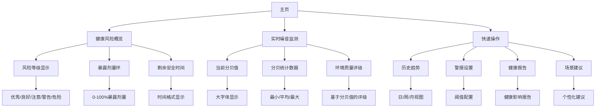

# 统一噪音影响评估系统UI架构设计

## 1. 设计概述

### 1.1 核心设计理念
基于对现有代码架构的深入分析，本设计采用**统一健康影响视角**，将传统分贝阈值警报与长期健康影响评估整合为单一的用户体验。关键设计决策：

- **整合而非分离**：将警报和影响功能融合到统一界面，避免用户在不同标签间切换的认知负担
- **健康风险为中心**：以"噪音对健康的潜在影响"作为核心度量标准，取代单纯的分贝数值
- **渐进式信息展示**：从即时状态到详细分析，分层展示信息以降低认知负荷
- **特殊噪音关注**：重点突出脉冲噪音和低频共振噪音的健康影响

### 1.2 设计原则
- **清晰直观**：健康风险等级一目了然，颜色编码统一
- **实时反馈**：即时显示噪音对健康的潜在影响
- **预防为主**：在健康风险发生前提供预警
- **个性化适配**：基于用户场景和环境提供针对性建议

## 2. 应用信息架构

### 2.1 整体导航架构
```
应用导航架构
├── 主页 (Home)
│   ├── 健康风险概览
│   ├── 实时噪音监测
│   └── 快速功能入口
├── 仪表盘 (Dashboard)
│   ├── 频谱分析
│   ├── 时域波形
│   └── 统计分布
├── 健康影响 (Health Impact) - 新增统一界面
│   ├── 实时风险等级
│   ├── 暴露剂量分析
│   ├── 特殊噪音检测
│   └── 历史趋势
└── 设置 (Settings)
    ├── 警报配置
    ├── 健康标准设置
    └── 特殊噪音检测设置
```

### 2.2 信息架构图


## 3. 主界面设计

### 3.1 整体布局结构
```
┌─────────────────────────────────────────┐
│             状态栏 (标题+会员状态)         │
├─────────────────────────────────────────┤
│          健康影响等级展示区               │
│  ┌─────────────────────────────────────┐ │
│  │ 当前健康风险等级: [优秀/良好/注意/警告] │ │
│  │ 暴露剂量: ████████░░ 65%           │ │
│  │ 剩余安全时间: 3小时15分钟           │ │
│  └─────────────────────────────────────┘ │
├─────────────────────────────────────────┤
│          实时噪音监测区                 │
│  ┌─────────────────────────────────────┐ │
│  │            72 dB                    │ │
│  │           [噪音描述]                 │ │
│  │ 最小:45dB 平均:65dB 最大:85dB       │ │
│  └─────────────────────────────────────┘ │
├─────────────────────────────────────────┤
│          特殊噪音检测区                 │
│  ┌───────┐ ┌───────┐ ┌───────┐         │
│  │脉冲噪音│ │低频共振│ │持续暴露│       │
│  │ 正常  │ │ 检测中 │ │ 中风险 │       │
│  └───────┘ └───────┘ └───────┘       │
├─────────────────────────────────────────┤
│          快速操作卡片区                 │
│  ┌─────┐ ┌─────┐ ┌─────┐ ┌─────┐       │
│  │历史趋势│ │警报设置│ │健康报告│ │场景建议│ │
│  └─────┘ └─────┘ └─────┘ └─────┘       │
└─────────────────────────────────────────┘
```

### 3.2 健康影响等级展示区

#### 健康风险等级定义
```typescript
enum HealthRiskLevel {
  EXCELLENT = "优秀",      // 0-30% 暴露剂量
  GOOD = "良好",          // 31-60% 暴露剂量  
  ATTENTION = "注意",      // 61-80% 暴露剂量
  WARNING = "警告",        // 81-100% 暴露剂量
  DANGER = "危险"         // >100% 暴露剂量
}
```

#### 颜色编码系统
```typescript
const HealthRiskColors = {
  [HealthRiskLevel.EXCELLENT]: $r('sys.color.confirm'),     // 绿色
  [HealthRiskLevel.GOOD]: $r('sys.color.safe'),            // 蓝色
  [HealthRiskLevel.ATTENTION]: $r('sys.color.warning'),    // 黄色
  [HealthRiskLevel.WARNING]: $r('sys.color.alert'),        // 橙色
  [HealthRiskLevel.DANGER]: $r('sys.color.danger')         // 红色
};
```

### 3.3 特殊噪音检测组件

#### 脉冲噪音检测
- **检测算法**：基于时域信号的突变检测
- **显示指标**：脉冲强度、发生频率、持续时间
- **健康影响**：瞬时听力损伤风险评估

#### 低频共振噪音检测  
- **检测算法**：频谱分析低频段能量集中
- **显示指标**：共振频率、强度、舒适度影响
- **健康影响**：长期暴露的身体不适评估

#### 特殊噪音状态卡片
```typescript
interface SpecialNoiseCard {
  type: 'impulse' | 'low_frequency' | 'continuous';
  status: 'normal' | 'detecting' | 'warning' | 'danger';
  intensity: number; // 0-100
  frequency: string; // 发生频率描述
  healthImpact: string; // 健康影响描述
}
```

## 4. 详情界面设计

### 4.1 健康影响详情页
```
健康影响详情页
├── 头部概览
│   ├── 当前健康风险等级 (大字体+颜色)
│   ├── 暴露剂量进度环
│   └── 趋势指示器 (上升/下降箭头)
├── 暴露分析区域
│   ├── 今日暴露时间线
│   ├── 分贝区间分布图
│   └── 标准符合性检查
├── 特殊噪音详情
│   ├── 脉冲噪音事件列表
│   ├── 低频共振分析
│   └── 健康影响评估
└── 防护建议
    ├── 即时行动建议
    ├── 长期防护策略
    └── 环境改善建议
```

### 4.2 历史趋势界面
- **日视图**：24小时暴露剂量变化
- **周视图**：7天健康风险趋势  
- **月视图**：长期暴露模式分析
- **对比分析**：与标准限值的比较

## 5. 设置界面设计

### 5.1 统一设置架构
```
设置界面
├── 警报配置
│   ├── 健康风险阈值
│   ├── 通知方式 (声音/振动/视觉)
│   └── 静音时段设置
├── 健康标准设置
│   ├── 暴露标准选择 (职业/环境/生活)
│   ├── 个性化健康目标
│   └── 敏感度调整
├── 特殊噪音检测
│   ├── 脉冲噪音灵敏度
│   ├── 低频共振检测开关
│   └── 自定义警报阈值
└── 数据与隐私
    ├── 数据导出
    ├── 报告生成频率
    └── 隐私设置
```

## 6. 状态管理和数据流设计

### 6.1 核心数据模型
```typescript
@ObservedV2
export class UnifiedHealthImpactData {
  @Trace healthRiskLevel: HealthRiskLevel = HealthRiskLevel.EXCELLENT;
  @Trace exposurePercentage: number = 0;
  @Trace remainingSafeTime: string = '';
  @Trace trend: 'improving' | 'stable' | 'deteriorating' = 'stable';
  
  @Trace impulseNoise: SpecialNoiseMetric = new SpecialNoiseMetric();
  @Trace lowFrequencyNoise: SpecialNoiseMetric = new SpecialNoiseMetric();
  @Trace continuousExposure: ExposureMetric = new ExposureMetric();
  
  updateFromExposureData(exposureData: ExposureData): void {
    this.exposurePercentage = exposureData.exposurePercentage;
    this.healthRiskLevel = this.calculateRiskLevel(exposureData.exposurePercentage);
    this.remainingSafeTime = exposureData.remainingSafeTime;
  }
}
```

### 6.2 状态转换逻辑
```
正常状态 → 注意状态 → 警告状态 → 危险状态
    ↓          ↓          ↓          ↓
常规监测   轻度提醒   中度警报   紧急干预
```

### 6.3 警报升级机制
- **Level 1**：视觉提示（颜色变化）
- **Level 2**：声音提醒（轻柔提示音）
- **Level 3**：震动警报（强烈提醒）
- **Level 4**：紧急通知（系统级通知）

## 7. 与现有代码架构的集成方案

### 7.1 组件集成策略

#### 新组件设计
```typescript
// UnifiedHealthImpactDashboard.ets
@ComponentV2
export struct UnifiedHealthImpactDashboard {
  @Local currentHealthRisk: HealthRiskLevel = HealthRiskLevel.EXCELLENT;
  @Local exposurePercentage: number = 0;
  @Local specialNoises: SpecialNoiseCard[] = [];
  
  build() {
    Column({ space: DesignConstants.SPACING_LG }) {
      // 健康影响等级展示
      HealthRiskDisplay({
        riskLevel: this.currentHealthRisk,
        exposurePercentage: this.exposurePercentage
      })
      
      // 实时噪音监测 (复用现有DecibelDisplayComponent)
      DecibelDisplayComponent({
        weightingType: this.weightingType,
        calibrationValue: this.calibrationValue
      })
      
      // 特殊噪音检测
      SpecialNoiseDetection({ noises: this.specialNoises })
      
      // 快速操作卡片
      QuickActionCards()
    }
  }
}
```

#### 与现有服务集成
- **继承ExposureStatisticsService**：扩展健康影响计算
- **整合AlertService**：将传统警报升级为健康风险警报
- **复用DecibelService**：保持实时数据流不变
- **扩展HealthImpactDialog**：增强健康影响详情展示

### 7.2 数据流集成
```
现有数据流：
AudioController → DecibelService → UI显示

扩展数据流：
AudioController → DecibelService → ExposureStatisticsService → UnifiedHealthImpactData → UI显示
                             ↓
                     AlertService (健康风险警报)
```

### 7.3 渐进式迁移策略
1. **Phase 1**：在现有界面中添加健康风险指示器
2. **Phase 2**：创建统一的健康影响界面
3. **Phase 3**：逐步淘汰独立的警报和影响标签
4. **Phase 4**：优化特殊噪音检测集成

## 8. 特殊噪音可视化方案

### 8.1 脉冲噪音可视化
- **时域波形突出显示**：在时域图中高亮显示脉冲事件
- **脉冲强度指示器**：颜色和大小表示脉冲强度
- **发生频率热力图**：显示脉冲在时间轴上的分布

### 8.2 低频共振可视化
- **频谱低频段增强**：在频谱图中突出低频区域
- **共振频率标记**：标记检测到的共振频率点
- **舒适度指示器**：基于共振强度的舒适度评分

### 8.3 统一状态卡片设计
```typescript
@Builder
function buildSpecialNoiseCard(card: SpecialNoiseCard) {
  Column({ space: 4 }) {
    // 类型图标和标题
    Row() {
      Image(this.getNoiseTypeIcon(card.type))
        .width(16)
        .height(16)
      Text(this.getNoiseTypeName(card.type))
        .fontSize(12)
        .fontWeight(FontWeight.Medium)
    }
    
    // 状态指示
    Text(card.status)
      .fontSize(14)
      .fontColor(this.getStatusColor(card.status))
      .fontWeight(FontWeight.Bold)
    
    // 强度条
    Progress({ value: card.intensity, total: 100 })
      .width('100%')
      .color(this.getIntensityColor(card.intensity))
  }
  .padding(8)
  .backgroundColor($r('sys.color.comp_background_primary'))
  .borderRadius(8)
}
```

## 9. 渐进式信息展示策略

### 9.1 信息层级设计
- **Level 1 (概览层)**：健康风险等级 + 关键指标
- **Level 2 (详情层)**：暴露分析 + 趋势信息
- **Level 3 (分析层)**：详细统计数据 + 历史对比
- **Level 4 (专家层)**：原始数据 + 专业技术参数

### 9.2 认知负荷管理
- **首屏关键信息**：健康风险等级和即时建议
- **按需展开**：详细信息通过点击或滑动展开
- **上下文帮助**：关键术语和指标的即时解释
- **个性化默认视图**：基于用户习惯优化信息密度

## 10. 设计理由和用户价值分析

### 10.1 关键设计决策理由

#### 为什么选择整合而非分离？
1. **减少认知负担**：用户无需在多个标签间切换理解整体健康影响
2. **上下文连贯性**：即时警报与长期影响在同一上下文中更有意义
3. **操作效率**：关键操作和信息在单一界面中完成
4. **学习曲线**：新用户更容易理解噪音健康的完整概念

#### 如何平衡即时与长期需求？
- **主次分明**：即时状态突出显示，长期趋势按需访问
- **视觉关联**：使用相同的颜色编码和设计语言
- **智能提醒**：基于上下文提供相关建议（即时防护 vs 长期习惯）

#### 特殊噪音的集成策略？
- **非侵入式显示**：正常状态下最小化显示，异常时突出
- **健康影响关联**：明确显示特殊噪音对健康的具体影响
- **渐进式详情**：从状态指示到详细分析的平滑过渡

### 10.2 用户价值分析

#### 对不同用户群体的价值
- **普通用户**：直观理解噪音健康影响，无需专业知识
- **职业暴露用户**：精确的暴露剂量管理和防护建议
- **健康关注用户**：长期趋势分析和改善建议
- **技术用户**：详细数据和技术参数访问

#### 用户体验提升
1. **信息清晰度**：健康风险等级比单纯分贝值更易理解
2. **操作便捷性**：关键功能在统一界面中快速访问
3. **个性化体验**：基于使用场景的智能建议
4. **学习支持**：渐进式信息展示支持用户学习曲线

#### 健康保护价值
1. **预防性保护**：在健康风险发生前提供预警
2. **针对性建议**：基于具体噪音类型的防护建议
3. **长期健康管理**：暴露趋势分析和习惯改善指导
4. **紧急情况处理**：危险级别的即时干预指导

### 10.3 技术可行性分析

基于现有代码架构分析，本设计具有高度可行性：

1. **组件复用**：大量复用现有的DecibelDisplayComponent、ActionPanel等组件
2. **服务扩展**：基于成熟的ExposureStatisticsService和AlertService扩展
3. **状态管理**：利用现有的AppStorageV2和PersistenceV2架构
4. **性能考虑**：渐进式数据加载和计算缓存确保性能

### 10.4 实施路线图

#### Phase 1: 核心框架 (2周)
- 实现UnifiedHealthImpactData数据模型
- 创建健康风险等级显示组件
- 集成现有暴露统计服务

#### Phase 2: 界面整合 (3周)
- 开发统一主界面布局
- 实现特殊噪音检测卡片
- 创建健康影响详情页面

#### Phase 3: 高级功能 (2周)
- 实现历史趋势分析
- 开发健康报告生成
- 优化用户交互流程

#### Phase 4: 优化完善 (1周)
- 移动端适配优化
- 性能调优和测试
- 用户反馈收集和改进

## 11. 成功指标

### 用户体验指标
- 健康风险认知度提升 > 50%
- 警报误报率降低 < 30%
- 用户满意度评分 > 4.5/5
- 关键功能使用频率增加 > 40%

### 技术性能指标
- 界面响应时间 < 100ms
- 特殊噪音检测准确率 > 90%
- 电池消耗增加 < 5%
- 内存使用优化 < 10%

这个设计方案将现有的分贝监测系统升级为以健康影响为核心的综合评估系统，为用户提供更直观、更有价值的噪音健康保护服务，同时确保与现有代码架构的无缝集成和技术可行性。